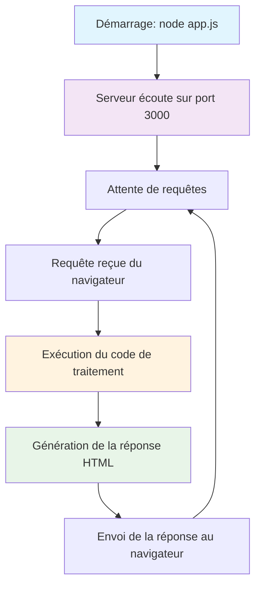
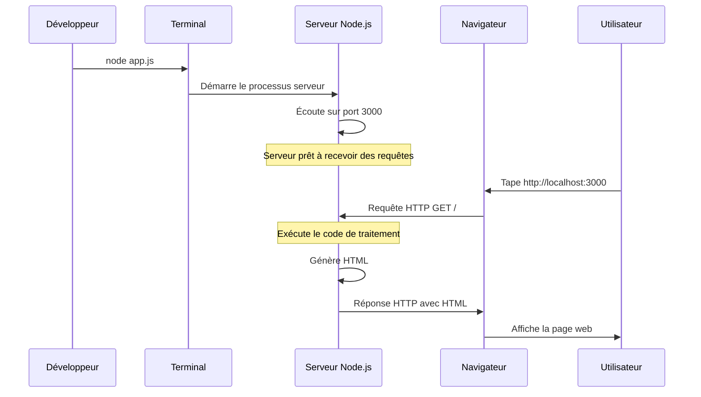
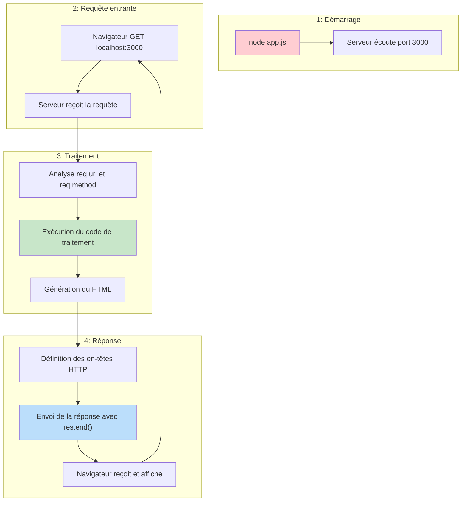

# Serveurs Web avec Node.js et Express.js

## 1. Introduction

Dans cette séance, nous allons apprendre à créer des serveurs web en utilisant Node.js et le framework Express.js. Nous explorerons comment créer des applications web côté serveur qui implémentent l'architecture client léger vue précédemment.

## 2. Prérequis

- Avoir Node.js installé sur votre machine (version 14 ou supérieure)
- Avoir un éditeur de code (comme Visual Studio Code ou WebStorm)
- Connaissances en JavaScript, HTML et CSS
- Compréhension de l'architecture client-serveur et du protocole HTTP

## 3. Environnement d'exécution Node.js

### 3.1 Comprendre l'exécution côté serveur

Contrairement au JavaScript que vous avez pu utiliser dans le navigateur (côté client), le code que nous écrivons maintenant s'exécute sur le **serveur** dans l'environnement **Node.js**. Voici les étapes d'exécution :

1. **Démarrage du serveur** : Quand vous exécutez `node app.js`, Node.js démarre un processus serveur
2. **Écoute du port** : Le serveur commence à "écouter" sur un port spécifique (comme le port 3000)
3. **Attente des requêtes** : Le serveur reste en vie et attend que des clients (navigateurs) lui envoient des requêtes
4. **Traitement des requêtes** : Pour chaque requête reçue, le serveur exécute le code approprié
5. **Envoi des réponses** : Le serveur génère et renvoie une réponse au client



### 3.2 Cycle de vie d'une requête HTTP dans Node.js



## 4. Serveur HTTP basique avec Node.js

### 4.1 Premier serveur HTTP

Node.js permet de créer facilement un serveur HTTP basique. Commençons par un exemple minimal qui sert une page HTML simple.

```javascript
// Importer le module HTTP
import http from 'http';

// Créer un serveur HTTP
const server = http.createServer((req, res) => {
  // Définir les en-têtes de réponse
  res.setHeader('Content-Type', 'text/html');
  
  // Envoyer une réponse HTML simple
  res.end(`
    <!DOCTYPE html>
    <html>
      <head>
        <title>Serveur Simple</title>
      </head>
      <body>
        <h1>Bonjour du serveur!</h1>
        <p>Ceci est une page servie par notre serveur Node.js</p>
      </body>
    </html>
  `);
});

// Démarrer le serveur sur le port 3000
const PORT = 3000;
server.listen(PORT, () => {
  console.log(`Serveur démarré sur http://localhost:${PORT}`);
});
```

### 4.2 Comment notre code Node.js traite HTTP

Dans notre serveur Node.js, voici ce qui se passe :

```javascript
const server = http.createServer((req, res) => {
  // req = objet représentant la requête HTTP reçue
  // res = objet pour construire et envoyer la réponse HTTP
  
  // Analyse de la requête
  console.log('Méthode:', req.method);      // GET, POST, etc.
  console.log('URL:', req.url);             // /accueil, /contact, etc.
  console.log('En-têtes:', req.headers);    // Tous les en-têtes
  
  // Construction de la réponse
  res.setHeader('Content-Type', 'text/html'); // Définit le type de contenu
  res.statusCode = 200;                        // Définit le code de statut
  res.end('<h1>Hello World!</h1>');           // Envoie le corps et termine
});
```

### 4.3 Flux complet dans notre application



### 4.4 Les limites de `http.createServer`

Bien que le module HTTP natif de Node.js soit fonctionnel, il présente des limitations importantes quand on souhaite créer des applications web plus complexes. Voici un exemple qui illustre ces difficultés :

```javascript
import http from 'http';
import url from 'url';

const server = http.createServer((req, res) => {
  // Parser l'URL et la méthode HTTP
  const parsedUrl = url.parse(req.url, true);
  const path = parsedUrl.pathname;
  const method = req.method;
  
  // Définir les en-têtes de base
  res.setHeader('Content-Type', 'text/html; charset=utf-8');
  
  // Gérer les différentes routes manuellement
  if (method === 'GET' && path === '/') {
    res.statusCode = 200;
    res.end('<h1>Accueil</h1><a href="/about">À propos</a> | <a href="/contact">Contact</a>');
  } 
  else if (method === 'GET' && path === '/about') {
    res.statusCode = 200;
    res.end('<h1>À propos</h1><p>Informations sur notre site</p>');
  } 
  else if (method === 'GET' && path === '/contact') {
    res.statusCode = 200;
    res.end('<h1>Contact</h1><form method="POST" action="/contact"><input type="text" name="message" placeholder="Votre message"><button type="submit">Envoyer</button></form>');
  } 
  else if (method === 'POST' && path === '/contact') {
    // Gérer les données POST devient très complexe
    let body = '';
    req.on('data', chunk => {
      body += chunk.toString();
    });
    req.on('end', () => {
      res.statusCode = 200;
      res.end('<h1>Message reçu!</h1><p>Merci pour votre message.</p>');
    });
  } 
  else {
    // Page 404
    res.statusCode = 404;
    res.end('<h1>404 - Page non trouvée</h1>');
  }
});

server.listen(3000, () => {
  console.log('Serveur démarré sur http://localhost:3000');
});
```

**Problèmes identifiés avec cette approche :**

1. **Code verbeux et répétitif** : Chaque route nécessite une condition `if/else`
2. **Gestion manuelle du parsing** : URLs, paramètres, et données POST doivent être parsés manuellement
3. **Pas de middleware** : Impossible de réutiliser facilement du code commun (authentification, logs, etc.)
4. **Gestion d'erreurs complexe** : Chaque cas d'erreur doit être géré individuellement
5. **Maintenance difficile** : Plus on ajoute de routes, plus le code devient ingérable
6. **Pas de support intégré** : Cookies, sessions, fichiers statiques nécessitent du code personnalisé

## 5. Introduction à Express.js

### 5.1 Qu'est-ce qu'Express.js ?

Express.js est un framework web minimaliste et flexible pour Node.js qui fournit un ensemble robuste de fonctionnalités pour les applications web et mobiles. Il simplifie la création de serveurs HTTP en Node.js avec une API plus intuitive et des fonctionnalités supplémentaires.

**Avantages d'Express.js :**
- Syntaxe simple et intuitive
- Système de routage puissant
- Support des middleware
- Gestion facilitée des requêtes et réponses
- Grande communauté et écosystème riche

### 5.2 Installation d'Express.js

Pour utiliser Express.js dans votre projet, vous devez d'abord l'installer via npm :

```bash
# Initialiser un projet Node.js
npm init -y

# Installer Express.js
npm install express
```

### 5.3 Premier serveur Express

Voici le même serveur que précédemment, mais réécrit avec Express.js :

```javascript
// Importer Express
import express from 'express';

// Créer une application Express
const app = express();

// Définir une route pour la page d'accueil
app.get('/', (req, res) => {
  res.send(`
    <!DOCTYPE html>
    <html>
      <head>
        <title>Serveur Express</title>
      </head>
      <body>
        <h1>Bonjour d'Express!</h1>
        <p>Ceci est une page servie par notre serveur Express</p>
        <ul>
          <li><a href="/about">À propos</a></li>
          <li><a href="/contact">Contact</a></li>
        </ul>
      </body>
    </html>
  `);
});

// Ajouter d'autres routes
app.get('/about', (req, res) => {
  res.send('<h1>À propos de nous</h1><p>Nous sommes une école qui enseigne le développement web.</p>');
});

app.get('/contact', (req, res) => {
  res.send('<h1>Contactez-nous</h1><p>Email: contact@exemple.com</p>');
});

// Gérer les routes inexistantes
app.use((req, res) => {
  res.status(404).send('<h1>404 - Page non trouvée</h1>');
});

// Démarrer le serveur
const PORT = 3000;
app.listen(PORT, () => {
  console.log(`Serveur Express démarré sur http://localhost:${PORT}`);
});
```

**Comparaison avec Node.js pur :**
- Code beaucoup plus concis et lisible
- Pas besoin de parser manuellement les URLs
- Gestion automatique des en-têtes HTTP basiques
- Syntaxe intuitive pour définir les routes

## 6. Routage avec Express.js

Le **routage** fait référence à la définition de la manière dont une application répond aux requêtes des clients vers des points de terminaison spécifiques (endpoints). Chaque endpoint est défini par un **chemin** (path) et une **méthode HTTP** spécifique (GET, POST, PUT, DELETE, etc.).

Dans Express.js, une route basique a la structure suivante :
```
app.MÉTHODE(PATH, HANDLER)
```

Où :
- `app` est une instance d'Express
- `MÉTHODE` est une méthode HTTP en minuscules (get, post, put, delete, etc.)
- `PATH` est le chemin sur le serveur (comme `/users`, `/contact`, etc.)
- `HANDLER` est la fonction exécutée quand la route correspond à la requête

### 6.1 Méthodes de routage

Express.js supporte toutes les méthodes HTTP principales correspondant aux opérations CRUD (Create, Read, Update, Delete). Chaque méthode a un rôle bien défini dans l'architecture REST :

- **GET** : Utilisé pour **récupérer** des données sans les modifier (opération de lecture)
- **POST** : Utilisé pour **créer** de nouvelles ressources (envoi de données au serveur)
- **PUT** : Utilisé pour **mettre à jour complètement** une ressource existante
- **DELETE** : Utilisé pour **supprimer** une ressource

```javascript
// GET - Récupérer des données
app.get('/users', (req, res) => {
  res.send('Liste des utilisateurs');
});

// POST - Créer de nouvelles données
app.post('/users', (req, res) => {
  res.send('Créer un nouvel utilisateur');
});

// PUT - Mettre à jour des données
app.put('/users/:id', (req, res) => {
  res.send(`Mettre à jour l'utilisateur ${req.params.id}`);
});

// DELETE - Supprimer des données
app.delete('/users/:id', (req, res) => {
  res.send(`Supprimer l'utilisateur ${req.params.id}`);
});
```

**Exemple concret d'utilisation :**
- `GET /users` → Afficher la liste de tous les utilisateurs
- `POST /users` → Créer un nouvel utilisateur avec les données du formulaire
- `PUT /users/123` → Modifier complètement l'utilisateur avec l'ID 123
- `DELETE /users/123` → Supprimer l'utilisateur avec l'ID 123

### 6.2 Paramètres de route

Les **paramètres de route** permettent de créer des URLs dynamiques où certaines parties peuvent varier. Dans Express, ils sont définis avec le préfixe `:` et sont automatiquement capturés dans l'objet `req.params`.

Cette fonctionnalité est essentielle pour créer des APIs flexibles qui peuvent traiter différentes ressources avec la même logique de base.

```javascript
// Paramètre simple
app.get('/users/:id', (req, res) => {
  const userId = req.params.id;
  res.send(`Profil de l'utilisateur ${userId}`);
});

// Plusieurs paramètres
app.get('/users/:userId/posts/:postId', (req, res) => {
  const { userId, postId } = req.params;
  res.send(`Post ${postId} de l'utilisateur ${userId}`);
});

// Paramètres optionnels
app.get('/products/:category?', (req, res) => {
  const category = req.params.category || 'tous';
  res.send(`Produits de la catégorie: ${category}`);
});
```

**Explications détaillées :**

1. **Paramètre simple** : `:id` capture n'importe quelle valeur après `/users/`
   - URL `/users/123` → `req.params.id` vaut `"123"`
   - URL `/users/jean` → `req.params.id` vaut `"jean"`

2. **Plusieurs paramètres** : Permet de créer des URLs hiérarchiques
   - URL `/users/123/posts/456` → `req.params.userId` = `"123"`, `req.params.postId` = `"456"`
   - Pratique pour naviguer dans des ressources imbriquées

3. **Paramètres optionnels** : Le `?` après `:category` rend ce paramètre facultatif
   - URL `/products` → `category` vaut `"tous"` (valeur par défaut)
   - URL `/products/electronique` → `category` vaut `"electronique"`

### 6.3 Query parameters (Paramètres de requête)

Les **query parameters** sont des paramètres passés dans l'URL après le symbole `?`. Ils sont particulièrement utiles pour :
- **Filtrer** des résultats (ex: par catégorie, prix, date)
- **Paginer** des listes longues
- **Trier** des données
- **Configurer** l'affichage

Express parse automatiquement ces paramètres et les rend disponibles dans l'objet `req.query`.

```javascript
// URL: /search?q=nodejs&limit=10&sort=date
app.get('/search', (req, res) => {
  const { q, limit, sort } = req.query;
  res.send(`Recherche: "${q}", Limite: ${limit}, Tri: ${sort}`);
});
```

**Exemples d'URLs et leurs paramètres :**
- `/search?q=javascript` → `req.query = { q: "javascript" }`
- `/search?q=nodejs&limit=5` → `req.query = { q: "nodejs", limit: "5" }`
- `/search?q=express&limit=10&sort=date&category=tutorial` → `req.query = { q: "express", limit: "10", sort: "date", category: "tutorial" }`

**Note importante :** Tous les query parameters sont des **chaînes de caractères**. Si vous avez besoin d'un nombre, pensez à le convertir avec `parseInt()` ou `Number()`.

```javascript
app.get('/products', (req, res) => {
  const page = parseInt(req.query.page) || 1; // Conversion en nombre avec valeur par défaut
  const limit = parseInt(req.query.limit) || 10;
  
  res.send(`Page ${page}, ${limit} produits par page`);
});
```

### 6.4 Combinaison de paramètres de route et query parameters

Il est courant de combiner les deux types de paramètres pour créer des APIs très flexibles :

```javascript
// URL: /users/123/posts?limit=5&sort=recent
app.get('/users/:userId/posts', (req, res) => {
  const userId = req.params.userId;        // Paramètre de route
  const limit = req.query.limit || 10;     // Query parameter
  const sort = req.query.sort || 'date';   // Query parameter
  
  res.send(`Posts de l'utilisateur ${userId}, limite: ${limit}, tri: ${sort}`);
});
```

Cette approche permet de créer des URLs expressives et intuitives qui reflètent la structure hiérarchique des données tout en offrant des options de personnalisation.

## 7. Middlewares Express

Les **middlewares** sont des fonctions qui s'exécutent pendant le cycle de vie d'une requête-réponse HTTP. Ils ont accès à l'objet de requête (`req`), l'objet de réponse (`res`), et au middleware suivant dans la pile via la fonction `next()`.

Les middlewares permettent de :
- **Exécuter du code** avant ou après le traitement d'une route
- **Modifier les objets** `req` et `res` pour les enrichir
- **Terminer le cycle** requête-réponse
- **Appeler le middleware suivant** dans la pile

### 7.1 Anatomie d'un middleware

Un middleware Express a la signature suivante :

```javascript
function monMiddleware(req, res, next) {
  // Code à exécuter
  console.log('Middleware exécuté!');
  
  // Appeler next() pour passer au middleware suivant
  next();
}
```

**Paramètres :**
- `req` : L'objet de requête HTTP
- `res` : L'objet de réponse HTTP  
- `next` : Fonction pour passer au middleware suivant

**Important :** Si vous n'appelez pas `next()`, la requête restera "suspendue" et le client n'obtiendra jamais de réponse !

### 7.2 Types de middlewares

#### 7.2.1 Middleware au niveau application

Ces middlewares s'exécutent pour **toutes** les requêtes de l'application.

```javascript
import express from 'express';
const app = express();

// Middleware de logging pour toutes les requêtes
app.use((req, res, next) => {
  const timestamp = new Date().toISOString();
  console.log(`[${timestamp}] ${req.method} ${req.url}`);
  next(); // Important : passer au middleware suivant
});

// Middleware pour ajouter un header de sécurité
app.use((req, res, next) => {
  res.setHeader('X-Powered-By', 'Mon Super Serveur');
  next();
});

// Vos routes normales
app.get('/', (req, res) => {
  res.send('Accueil');
});

app.listen(3000);
```

#### 7.2.2 Middleware au niveau route

Ces middlewares s'exécutent uniquement pour des routes spécifiques.

```javascript
// Middleware d'authentification simple
function requireAuth(req, res, next) {
  const authHeader = req.headers.authorization;
  
  if (!authHeader) {
    return res.status(401).send('Authentification requise');
  }
  
  // Simulation de vérification d'authentification
  if (authHeader === 'Bearer secret-token') {
    next(); // Authentifié, continuer
  } else {
    res.status(403).send('Token invalide');
  }
}

// Utiliser le middleware sur une route spécifique
app.get('/dashboard', requireAuth, (req, res) => {
  res.send('Bienvenue dans votre dashboard !');
});

// Utiliser plusieurs middlewares sur une route
app.get('/admin', requireAuth, requireAdminRole, (req, res) => {
  res.send('Panel d\'administration');
});

function requireAdminRole(req, res, next) {
  // Logique pour vérifier le rôle admin
  const isAdmin = true; // Simulation
  if (isAdmin) {
    next();
  } else {
    res.status(403).send('Accès admin requis');
  }
}
```

#### 7.2.3 Middleware de gestion d'erreurs

Ces middlewares spéciaux ont **4 paramètres** et gèrent les erreurs de l'application.

```javascript
// Middleware de gestion d'erreurs (doit être à la fin)
app.use((err, req, res, next) => {
  console.error('Erreur capturée:', err.message);
  res.status(500).send('Quelque chose s\'est mal passé !');
});

// Exemple de route qui génère une erreur
app.get('/error-test', (req, res, next) => {
  const error = new Error('Ceci est une erreur de test');
  next(error); // Passer l'erreur au middleware de gestion d'erreurs
});
```

### 7.3 Middlewares intégrés Express

Express fournit quelques middlewares intégrés très utiles :

```javascript
// Servir des fichiers statiques (CSS, images, JS)
app.use(express.static('public'));

// Parser le JSON dans les requêtes POST
app.use(express.json());

// Parser les données de formulaires
app.use(express.urlencoded({ extended: true }));
```

### 7.4 Exemple complet avec middlewares

```javascript
import express from 'express';
const app = express();

// 1. Middleware de logging (pour toutes les requêtes)
app.use((req, res, next) => {
  console.log(`${new Date().toISOString()} - ${req.method} ${req.url}`);
  next();
});

// 2. Middleware pour parser JSON
app.use(express.json());

// 3. Middleware pour servir des fichiers statiques
app.use(express.static('public'));

// 4. Middleware d'authentification personnalisé
function authenticate(req, res, next) {
  const token = req.headers.authorization;
  if (token === 'Bearer abc123') {
    req.user = { id: 1, name: 'John Doe' }; // Ajouter l'utilisateur à req
    next();
  } else {
    res.status(401).json({ error: 'Token manquant ou invalide' });
  }
}

// 5. Routes publiques
app.get('/', (req, res) => {
  res.send('Page d\'accueil publique');
});

app.get('/about', (req, res) => {
  res.send('À propos - page publique');
});

// 6. Routes protégées (avec middleware d'authentification)
app.get('/profile', authenticate, (req, res) => {
  res.json({
    message: `Bienvenue ${req.user.name}!`,
    user: req.user
  });
});

app.post('/data', authenticate, (req, res) => {
  res.json({
    message: 'Données reçues',
    user: req.user.name,
    receivedData: req.body
  });
});

// 7. Middleware de gestion des erreurs 404
app.use((req, res) => {
  res.status(404).send('Page non trouvée');
});

// 8. Middleware de gestion d'erreurs générales
app.use((err, req, res, next) => {
  console.error(err.stack);
  res.status(500).send('Erreur interne du serveur');
});

app.listen(3000, () => {
  console.log('Serveur démarré sur http://localhost:3000');
});
```

### 7.5 Ordre d'exécution des middlewares

L'ordre de définition des middlewares est **crucial** car ils s'exécutent séquentiellement :

```javascript
// ❌ MAUVAIS : Le middleware de logging ne verra jamais les requêtes
app.get('/', (req, res) => {
  res.send('Accueil');
});

app.use((req, res, next) => {
  console.log('Cette ligne ne s\'exécutera jamais pour "/"');
  next();
});

// ✅ BON : Le middleware s'exécute avant les routes
app.use((req, res, next) => {
  console.log('Ce middleware s\'exécute pour toutes les requêtes');
  next();
});

app.get('/', (req, res) => {
  res.send('Accueil');
});
```

## 8. Routers Express

Quand une application grandit, organiser toutes les routes dans un seul fichier devient rapidement ingérable. Les **routers** Express permettent de créer des groupes modulaires de routes que l'on peut organiser par fonctionnalité.

Un router Express est comme une "mini-application" qui peut avoir ses propres middlewares et routes, puis être "montée" sur l'application principale.

### 8.1 Pourquoi utiliser des routers ?

**Problème sans routers :**

```javascript
// app.js - Tout dans un seul fichier (difficile à maintenir)
import express from 'express';
const app = express();

// Routes utilisateurs
app.get('/users', (req, res) => { /* ... */ });
app.get('/users/:id', (req, res) => { /* ... */ });
app.post('/users', (req, res) => { /* ... */ });
app.put('/users/:id', (req, res) => { /* ... */ });
app.delete('/users/:id', (req, res) => { /* ... */ });

// Routes produits
app.get('/products', (req, res) => { /* ... */ });
app.get('/products/:id', (req, res) => { /* ... */ });
app.post('/products', (req, res) => { /* ... */ });
// ... 50 autres routes ...

// Routes commandes
app.get('/orders', (req, res) => { /* ... */ });
// ... encore plus de routes ...

app.listen(3000);
```

**Solution avec routers :**

```javascript
// app.js - Application principale propre
import express from 'express';
import userRoutes from './routes/users.js';
import productRoutes from './routes/products.js';
import orderRoutes from './routes/orders.js';

const app = express();

app.use(express.json());

// Monter les routers
app.use('/users', userRoutes);
app.use('/products', productRoutes);
app.use('/orders', orderRoutes);

app.listen(3000);
```

### 8.2 Créer un router basique

**Fichier : `routes/users.js`**

```javascript
import express from 'express';
const router = express.Router();

// Simuler une base de données d'utilisateurs
let users = [
  { id: 1, name: 'Alice', email: 'alice@exemple.com' },
  { id: 2, name: 'Bob', email: 'bob@exemple.com' },
  { id: 3, name: 'Charlie', email: 'charlie@exemple.com' }
];

// GET /users - Lister tous les utilisateurs
router.get('/', (req, res) => {
  res.json({
    message: 'Liste des utilisateurs',
    users: users
  });
});

// GET /users/:id - Obtenir un utilisateur spécifique
router.get('/:id', (req, res) => {
  const userId = parseInt(req.params.id);
  const user = users.find(u => u.id === userId);
  
  if (!user) {
    return res.status(404).json({ error: 'Utilisateur non trouvé' });
  }
  
  res.json({
    message: 'Utilisateur trouvé',
    user: user
  });
});

// POST /users - Créer un nouvel utilisateur
router.post('/', (req, res) => {
  const { name, email } = req.body;
  
  if (!name || !email) {
    return res.status(400).json({ 
      error: 'Le nom et l\'email sont requis' 
    });
  }
  
  const newUser = {
    id: users.length + 1,
    name: name,
    email: email
  };
  
  users.push(newUser);
  
  res.status(201).json({
    message: 'Utilisateur créé',
    user: newUser
  });
});

// PUT /users/:id - Mettre à jour un utilisateur
router.put('/:id', (req, res) => {
  const userId = parseInt(req.params.id);
  const userIndex = users.findIndex(u => u.id === userId);
  
  if (userIndex === -1) {
    return res.status(404).json({ error: 'Utilisateur non trouvé' });
  }
  
  const { name, email } = req.body;
  
  if (name) users[userIndex].name = name;
  if (email) users[userIndex].email = email;
  
  res.json({
    message: 'Utilisateur mis à jour',
    user: users[userIndex]
  });
});

// DELETE /users/:id - Supprimer un utilisateur
router.delete('/:id', (req, res) => {
  const userId = parseInt(req.params.id);
  const userIndex = users.findIndex(u => u.id === userId);
  
  if (userIndex === -1) {
    return res.status(404).json({ error: 'Utilisateur non trouvé' });
  }
  
  const deletedUser = users.splice(userIndex, 1)[0];
  
  res.json({
    message: 'Utilisateur supprimé',
    user: deletedUser
  });
});

module.exports = router;
```

**Fichier : `app.js`**

```javascript
import express from 'express';
import userRoutes from './routes/users.js';

const app = express();

// Middlewares globaux
app.use(express.json());

// Monter le router users sur le préfixe /users
app.use('/users', userRoutes);

// Route d'accueil
app.get('/', (req, res) => {
  res.json({
    message: 'API démarrée',
    endpoints: [
      'GET /users - Liste des utilisateurs',
      'GET /users/:id - Détails d\'un utilisateur',
      'POST /users - Créer un utilisateur',
      'PUT /users/:id - Modifier un utilisateur',
      'DELETE /users/:id - Supprimer un utilisateur'
    ]
  });
});

app.listen(3000, () => {
  console.log('Serveur démarré sur http://localhost:3000');
});
```

### 8.3 Router avec middlewares spécifiques

Les routers peuvent avoir leurs propres middlewares qui ne s'appliquent qu'aux routes de ce router :

**Fichier : `routes/admin.js`**

```javascript
import express from 'express';
const router = express.Router();

// Middleware spécifique au router admin
router.use((req, res, next) => {
  console.log('Accès à la section admin:', new Date().toISOString());
  next();
});

// Middleware d'authentification admin
router.use((req, res, next) => {
  const authHeader = req.headers.authorization;
  
  if (authHeader !== 'Bearer admin-token') {
    return res.status(403).json({ error: 'Accès admin requis' });
  }
  
  next();
});

// Routes admin (toutes protégées par les middlewares ci-dessus)
router.get('/dashboard', (req, res) => {
  res.json({
    message: 'Dashboard admin',
    stats: {
      users: 150,
      orders: 45,
      revenue: '12,345€'
    }
  });
});

router.get('/users', (req, res) => {
  res.json({
    message: 'Gestion des utilisateurs admin',
    actions: ['view', 'edit', 'delete', 'ban']
  });
});

router.delete('/users/:id', (req, res) => {
  const userId = req.params.id;
  res.json({
    message: `Utilisateur ${userId} supprimé par admin`
  });
});

module.exports = router;
```

### 8.4 Router avec paramètres et sous-routers

Vous pouvez créer des structures de routes complexes avec des routers imbriqués :

**Fichier : `routes/blog.js`**

```javascript
import express from 'express';
const router = express.Router();

// Simuler des données de blog
const posts = [
  { id: 1, title: 'Introduction à Node.js', content: 'Node.js est...', authorId: 1 },
  { id: 2, title: 'Express.js avancé', content: 'Express permet...', authorId: 2 }
];

const comments = [
  { id: 1, postId: 1, author: 'Alice', content: 'Super article !' },
  { id: 2, postId: 1, author: 'Bob', content: 'Très instructif' },
  { id: 3, postId: 2, author: 'Charlie', content: 'J\'ai appris beaucoup' }
];

// Routes pour les posts
router.get('/', (req, res) => {
  res.json({
    message: 'Liste des articles de blog',
    posts: posts
  });
});

router.get('/:postId', (req, res) => {
  const postId = parseInt(req.params.postId);
  const post = posts.find(p => p.id === postId);
  
  if (!post) {
    return res.status(404).json({ error: 'Article non trouvé' });
  }
  
  res.json({
    message: 'Article trouvé',
    post: post
  });
});

// Routes pour les commentaires d'un post
router.get('/:postId/comments', (req, res) => {
  const postId = parseInt(req.params.postId);
  const postComments = comments.filter(c => c.postId === postId);
  
  res.json({
    message: `Commentaires pour l'article ${postId}`,
    comments: postComments
  });
});

router.post('/:postId/comments', (req, res) => {
  const postId = parseInt(req.params.postId);
  const { author, content } = req.body;
  
  if (!author || !content) {
    return res.status(400).json({ 
      error: 'Auteur et contenu requis' 
    });
  }
  
  const newComment = {
    id: comments.length + 1,
    postId: postId,
    author: author,
    content: content
  };
  
  comments.push(newComment);
  
  res.status(201).json({
    message: 'Commentaire ajouté',
    comment: newComment
  });
});

module.exports = router;
```

### 8.5 Application complète avec plusieurs routers

**Structure de fichiers :**
```
project/
├── app.js
├── package.json
└── routes/
    ├── users.js
    ├── admin.js
    └── blog.js
```

**Fichier : `app.js`**

```javascript
import express from 'express';
import userRoutes from './routes/users.js';
import adminRoutes from './routes/admin.js';
import blogRoutes from './routes/blog.js';

const app = express();

// Middlewares globaux
app.use(express.json());
app.use(express.urlencoded({ extended: true }));

// Middleware de logging global
app.use((req, res, next) => {
  console.log(`[${new Date().toISOString()}] ${req.method} ${req.url}`);
  next();
});

// Monter les routers avec leurs préfixes
app.use('/users', userRoutes);      // Routes : /users/*
app.use('/admin', adminRoutes);     // Routes : /admin/*
app.use('/blog', blogRoutes);       // Routes : /blog/*

// Route d'accueil avec documentation API
app.get('/', (req, res) => {
  res.json({
    message: 'API Multi-Router Example',
    version: '1.0.0',
    endpoints: {
      users: [
        'GET /users - Liste des utilisateurs',
        'GET /users/:id - Détails d\'un utilisateur',
        'POST /users - Créer un utilisateur',
        'PUT /users/:id - Modifier un utilisateur',
        'DELETE /users/:id - Supprimer un utilisateur'
      ],
      admin: [
        'GET /admin/dashboard - Dashboard admin (auth requise)',
        'GET /admin/users - Gestion utilisateurs (auth requise)',
        'DELETE /admin/users/:id - Supprimer utilisateur (auth requise)'
      ],
      blog: [
        'GET /blog - Liste des articles',
        'GET /blog/:postId - Détails d\'un article',
        'GET /blog/:postId/comments - Commentaires d\'un article',
        'POST /blog/:postId/comments - Ajouter un commentaire'
      ]
    }
  });
});

// Middleware 404 pour les routes non trouvées
app.use((req, res) => {
  res.status(404).json({
    error: 'Endpoint non trouvé',
    requested: `${req.method} ${req.url}`,
    suggestion: 'Voir GET / pour la liste des endpoints disponibles'
  });
});

// Middleware de gestion d'erreurs
app.use((err, req, res, next) => {
  console.error('Erreur:', err.message);
  res.status(500).json({
    error: 'Erreur interne du serveur',
    message: err.message
  });
});

const PORT = process.env.PORT || 3000;
app.listen(PORT, () => {
  console.log(`🚀 Serveur démarré sur http://localhost:${PORT}`);
  console.log(`📖 Documentation API : http://localhost:${PORT}/`);
});
```

### 8.6 Tests des endpoints avec des exemples curl

Une fois votre serveur démarré, vous pouvez tester vos endpoints :

```bash
# Tester la route d'accueil
curl http://localhost:3000/

# Tester les utilisateurs
curl http://localhost:3000/users
curl http://localhost:3000/users/1

# Créer un utilisateur
curl -X POST http://localhost:3000/users \
  -H "Content-Type: application/json" \
  -d '{"name":"David","email":"david@exemple.com"}'

# Tester le blog
curl http://localhost:3000/blog
curl http://localhost:3000/blog/1/comments

# Tester l'admin (va échouer sans auth)
curl http://localhost:3000/admin/dashboard

# Tester l'admin avec authentification
curl http://localhost:3000/admin/dashboard \
  -H "Authorization: Bearer admin-token"
```

Cette approche modulaire avec des routers permet de :
- **Organiser** le code de manière logique
- **Réutiliser** des middlewares spécifiques
- **Maintenir** facilement l'application
- **Collaborer** efficacement en équipe (chaque développeur peut travailler sur un router différent)

## 9. Exercices pratiques

### Exercice 1 : Premier serveur Express

**Objectif :** Créer un serveur Express basique avec plusieurs routes simples.

**Consigne :**
1. Créez un fichier `app.js` qui utilise Express
2. Créez les routes suivantes :
   - `GET /` qui retourne `"Bienvenue sur mon serveur Express!"`
   - `GET /about` qui retourne `"À propos : Ce serveur a été créé avec Express.js"`
   - `GET /contact` qui retourne `"Contact : email@exemple.com"`
3. Le serveur doit écouter sur le port 3000
4. Ajoutez une route pour gérer les pages non trouvées (404)

**Sortie attendue :**
- `GET http://localhost:3000/` → `"Bienvenue sur mon serveur Express!"`
- `GET http://localhost:3000/about` → `"À propos : Ce serveur a été créé avec Express.js"`
- `GET http://localhost:3000/contact` → `"Contact : email@exemple.com"`
- `GET http://localhost:3000/inexistant` → Status 404 + message d'erreur

<details>
<summary>🔍 Solution Exercice 1</summary>

```javascript
import express from 'express';
const app = express();

// Routes principales
app.get('/', (req, res) => {
  res.send('Bienvenue sur mon serveur Express!');
});

app.get('/about', (req, res) => {
  res.send('À propos : Ce serveur a été créé avec Express.js');
});

app.get('/contact', (req, res) => {
  res.send('Contact : email@exemple.com');
});

// Route 404 (doit être à la fin)
app.use((req, res) => {
  res.status(404).send('Page non trouvée');
});

const PORT = 3000;
app.listen(PORT, () => {
  console.log(`Serveur démarré sur http://localhost:${PORT}`);
});
```

</details>

### Exercice 2 : Paramètres de route et query parameters

**Objectif :** Comprendre l'utilisation des paramètres de route et des query parameters.

**Consigne :**
Créez un serveur avec les routes suivantes :
1. `GET /users/:id` qui retourne `"Utilisateur ID: {id}"`
2. `GET /products/:category/:id` qui retourne `"Produit {id} dans la catégorie {category}"`
3. `GET /search` qui utilise les query parameters `q` et `limit` pour retourner :
   `"Recherche: {q}, Limite: {limit}"`
   Si `limit` n'est pas fourni, utilisez la valeur par défaut 10

**Sortie attendue :**
- `GET /users/123` → `"Utilisateur ID: 123"`
- `GET /products/electronique/456` → `"Produit 456 dans la catégorie electronique"`
- `GET /search?q=javascript&limit=5` → `"Recherche: javascript, Limite: 5"`
- `GET /search?q=nodejs` → `"Recherche: nodejs, Limite: 10"`

<details>
<summary>🔍 Solution Exercice 2</summary>

```javascript
import express from 'express';
const app = express();

app.get('/users/:id', (req, res) => {
  const id = req.params.id;
  res.send(`Utilisateur ID: ${id}`);
});

app.get('/products/:category/:id', (req, res) => {
  const { category, id } = req.params;
  res.send(`Produit ${id} dans la catégorie ${category}`);
});

app.get('/search', (req, res) => {
  const q = req.query.q;
  const limit = req.query.limit || 10;
  res.send(`Recherche: ${q}, Limite: ${limit}`);
});

app.listen(3000, () => {
  console.log('Serveur démarré sur http://localhost:3000');
});
```

</details>

### Exercice 3 : Middleware de logging

**Objectif :** Créer et utiliser un middleware personnalisé.

**Consigne :**
1. Créez un middleware qui log chaque requête avec le format :
   `"[TIMESTAMP] METHODE URL"`
2. Appliquez ce middleware à toutes les routes
3. Créez trois routes simples (`/`, `/test`, `/api`) qui retournent des messages différents

**Sortie attendue dans la console :**
```
[2025-09-24T10:30:45.123Z] GET /
[2025-09-24T10:30:47.456Z] GET /test
[2025-09-24T10:30:50.789Z] POST /api
```

<details>
<summary>🔍 Solution Exercice 3</summary>

```javascript
import express from 'express';
const app = express();

// Middleware de logging
app.use((req, res, next) => {
  const timestamp = new Date().toISOString();
  console.log(`[${timestamp}] ${req.method} ${req.url}`);
  next();
});

// Routes
app.get('/', (req, res) => {
  res.send('Page d\'accueil');
});

app.get('/test', (req, res) => {
  res.send('Page de test');
});

app.get('/api', (req, res) => {
  res.send('API endpoint');
});

app.listen(3000, () => {
  console.log('Serveur démarré sur http://localhost:3000');
});
```

</details>

### Exercice 4 : Middleware d'authentification simple

**Objectif :** Créer un middleware d'authentification et l'appliquer à des routes spécifiques.

**Consigne :**
1. Créez un middleware `requireAuth` qui vérifie la présence du header `authorization`
2. Si le header vaut `"Bearer secret123"`, autoriser l'accès
3. Sinon, retourner une erreur 401 avec le message `"Accès non autorisé"`
4. Créez les routes :
   - `GET /public` (accessible à tous) → `"Page publique"`
   - `GET /private` (protégée) → `"Page privée - accès autorisé"`
   - `GET /admin` (protégée) → `"Panel admin - accès autorisé"`

**Sortie attendue :**
- `GET /public` → `"Page publique"` (200)
- `GET /private` → `"Accès non autorisé"` (401)
- `GET /private` avec `Authorization: Bearer secret123` → `"Page privée - accès autorisé"` (200)

<details>
<summary>🔍 Solution Exercice 4</summary>

```javascript
import express from 'express';
const app = express();

// Middleware d'authentification
function requireAuth(req, res, next) {
  const auth = req.headers.authorization;
  
  if (auth === 'Bearer secret123') {
    next(); // Accès autorisé, passer au middleware suivant
  } else {
    res.status(401).send('Accès non autorisé');
  }
}

// Route publique
app.get('/public', (req, res) => {
  res.send('Page publique');
});

// Routes protégées
app.get('/private', requireAuth, (req, res) => {
  res.send('Page privée - accès autorisé');
});

app.get('/admin', requireAuth, (req, res) => {
  res.send('Panel admin - accès autorisé');
});

app.listen(3000, () => {
  console.log('Serveur démarré sur http://localhost:3000');
});
```

</details>

### Exercice 5 : API JSON avec POST

**Objectif :** Créer une API qui gère les données JSON en GET et POST.

**Consigne :**
1. Configurez Express pour parser le JSON
2. Créez un tableau `users` en mémoire avec quelques utilisateurs de test
3. Implémentez les routes :
   - `GET /api/users` → Retourner tous les utilisateurs en JSON
   - `GET /api/users/:id` → Retourner un utilisateur spécifique ou erreur 404
   - `POST /api/users` → Ajouter un nouvel utilisateur (avec validation)
4. Pour le POST, vérifiez que `name` et `email` sont fournis

**Sortie attendue :**
- `GET /api/users` → `{"users": [{"id": 1, "name": "Alice", "email": "alice@test.com"}, ...]}`
- `GET /api/users/1` → `{"user": {"id": 1, "name": "Alice", "email": "alice@test.com"}}`
- `GET /api/users/999` → Status 404 + `{"error": "Utilisateur non trouvé"}`
- `POST /api/users` avec body `{"name": "Bob", "email": "bob@test.com"}` → Status 201 + utilisateur créé

<details>
<summary>🔍 Solution Exercice 5</summary>

```javascript
import express from 'express';
const app = express();

// Middleware pour parser JSON
app.use(express.json());

// Base de données simulée
let users = [
  { id: 1, name: 'Alice', email: 'alice@test.com' },
  { id: 2, name: 'Bob', email: 'bob@test.com' }
];
let nextId = 3;

// GET tous les utilisateurs
app.get('/api/users', (req, res) => {
  res.json({ users: users });
});

// GET un utilisateur spécifique
app.get('/api/users/:id', (req, res) => {
  const id = parseInt(req.params.id);
  const user = users.find(u => u.id === id);
  
  if (!user) {
    return res.status(404).json({ error: 'Utilisateur non trouvé' });
  }
  
  res.json({ user: user });
});

// POST créer un utilisateur
app.post('/api/users', (req, res) => {
  const { name, email } = req.body;
  
  // Validation
  if (!name || !email) {
    return res.status(400).json({ 
      error: 'Le nom et l\'email sont requis' 
    });
  }
  
  const newUser = {
    id: nextId++,
    name: name,
    email: email
  };
  
  users.push(newUser);
  
  res.status(201).json({ 
    message: 'Utilisateur créé', 
    user: newUser 
  });
});

app.listen(3000, () => {
  console.log('API démarrée sur http://localhost:3000');
});
```

</details>

### Exercice 6 : Router modulaire

**Objectif :** Organiser le code avec des routers Express.

**Consigne :**
1. Créez un dossier `routes` avec un fichier `products.js`
2. Dans `products.js`, créez un router avec les routes :
   - `GET /` → Liste des produits
   - `GET /:id` → Détails d'un produit
   - `POST /` → Ajouter un produit
3. Dans `app.js`, montez ce router sur le préfixe `/products`
4. Ajoutez aussi une route d'accueil `GET /` dans `app.js`

**Structure attendue :**
```
projet/
├── app.js
└── routes/
    └── products.js
```

**Sortie attendue :**
- `GET /` → Message d'accueil
- `GET /products` → Liste des produits
- `GET /products/1` → Détails du produit 1
- `POST /products` → Créer un produit

<details>
<summary>🔍 Solution Exercice 6</summary>

**Fichier : `routes/products.js`**
```javascript
import express from 'express';
const router = express.Router();

// Base de données simulée
let products = [
  { id: 1, name: 'Ordinateur', price: 800 },
  { id: 2, name: 'Souris', price: 25 }
];
let nextId = 3;

// GET tous les produits
router.get('/', (req, res) => {
  res.json({ products: products });
});

// GET un produit spécifique
router.get('/:id', (req, res) => {
  const id = parseInt(req.params.id);
  const product = products.find(p => p.id === id);
  
  if (!product) {
    return res.status(404).json({ error: 'Produit non trouvé' });
  }
  
  res.json({ product: product });
});

// POST créer un produit
router.post('/', (req, res) => {
  const { name, price } = req.body;
  
  if (!name || !price) {
    return res.status(400).json({ 
      error: 'Le nom et le prix sont requis' 
    });
  }
  
  const newProduct = {
    id: nextId++,
    name: name,
    price: parseFloat(price)
  };
  
  products.push(newProduct);
  
  res.status(201).json({ 
    message: 'Produit créé', 
    product: newProduct 
  });
});

module.exports = router;
```

**Fichier : `app.js`**
```javascript
import express from 'express';
import productRoutes from './routes/products.js';

const app = express();

// Middlewares
app.use(express.json());

// Route d'accueil
app.get('/', (req, res) => {
  res.json({
    message: 'API E-commerce',
    endpoints: [
      'GET /products - Liste des produits',
      'GET /products/:id - Détails d\'un produit',
      'POST /products - Créer un produit'
    ]
  });
});

// Monter le router products
app.use('/products', productRoutes);

app.listen(3000, () => {
  console.log('Serveur démarré sur http://localhost:3000');
});
```

</details>

### Exercice 7 : Application complète avec middlewares et routers

**Objectif :** Combiner tous les concepts vus dans un exercice plus complet.

**Consigne :**
1. Créez une API de gestion de tâches (todo) avec :
   - Un middleware de logging global
   - Un router `tasks.js` pour gérer les tâches
   - Un middleware d'authentification sur certaines routes
2. Structure des tâches : `{ id, title, completed, createdAt }`
3. Routes à implémenter :
   - `GET /` → Documentation de l'API (public)
   - `GET /tasks` → Lister les tâches (protégé)
   - `POST /tasks` → Créer une tâche (protégé)
   - `PUT /tasks/:id/complete` → Marquer une tâche comme terminée (protégé)

**Sortie attendue :**
- Console : Logs de toutes les requêtes
- `GET /tasks` sans auth → Status 401
- `GET /tasks` avec `Authorization: Bearer task-token` → Liste des tâches
- `POST /tasks` avec body valide → Tâche créée (Status 201)

<details>
<summary>🔍 Solution Exercice 7</summary>

**Fichier : `routes/tasks.js`**
```javascript
import express from 'express';
const router = express.Router();

// Base de données simulée
let tasks = [
  { 
    id: 1, 
    title: 'Apprendre Express.js', 
    completed: false, 
    createdAt: new Date().toISOString() 
  }
];
let nextId = 2;

// Middleware d'authentification pour ce router
router.use((req, res, next) => {
  const auth = req.headers.authorization;
  
  if (auth !== 'Bearer task-token') {
    return res.status(401).json({ error: 'Authentification requise' });
  }
  
  next();
});

// GET toutes les tâches
router.get('/', (req, res) => {
  res.json({ tasks: tasks });
});

// POST créer une tâche
router.post('/', (req, res) => {
  const { title } = req.body;
  
  if (!title) {
    return res.status(400).json({ error: 'Le titre est requis' });
  }
  
  const newTask = {
    id: nextId++,
    title: title,
    completed: false,
    createdAt: new Date().toISOString()
  };
  
  tasks.push(newTask);
  
  res.status(201).json({ 
    message: 'Tâche créée', 
    task: newTask 
  });
});

// PUT marquer une tâche comme terminée
router.put('/:id/complete', (req, res) => {
  const id = parseInt(req.params.id);
  const task = tasks.find(t => t.id === id);
  
  if (!task) {
    return res.status(404).json({ error: 'Tâche non trouvée' });
  }
  
  task.completed = true;
  
  res.json({ 
    message: 'Tâche marquée comme terminée', 
    task: task 
  });
});

module.exports = router;
```

**Fichier : `app.js`**
```javascript
import express from 'express';
import taskRoutes from './routes/tasks.js';

const app = express();

// Middlewares globaux
app.use(express.json());

// Middleware de logging global
app.use((req, res, next) => {
  const timestamp = new Date().toISOString();
  console.log(`[${timestamp}] ${req.method} ${req.url}`);
  next();
});

// Route d'accueil (publique)
app.get('/', (req, res) => {
  res.json({
    message: 'API de gestion de tâches',
    version: '1.0.0',
    endpoints: [
      'GET /tasks - Lister les tâches (auth requise)',
      'POST /tasks - Créer une tâche (auth requise)', 
      'PUT /tasks/:id/complete - Terminer une tâche (auth requise)'
    ],
    auth: 'Utiliser le header Authorization: Bearer task-token'
  });
});

// Monter le router des tâches
app.use('/tasks', taskRoutes);

// Middleware 404
app.use((req, res) => {
  res.status(404).json({ error: 'Endpoint non trouvé' });
});

app.listen(3000, () => {
  console.log('🚀 API Todo démarrée sur http://localhost:3000');
});
```

</details>

