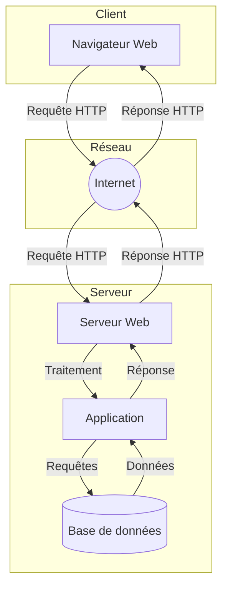
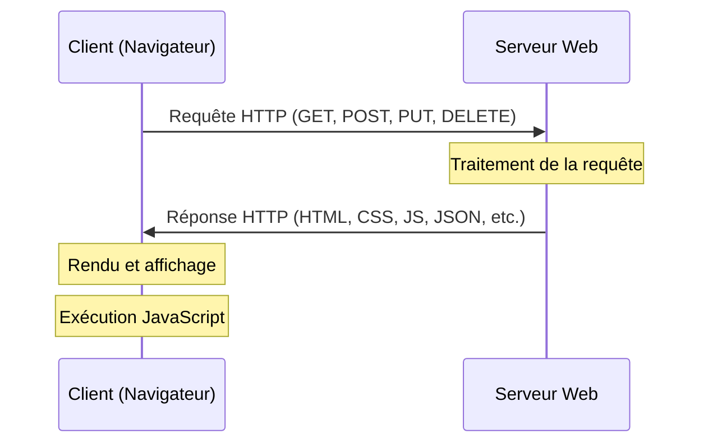
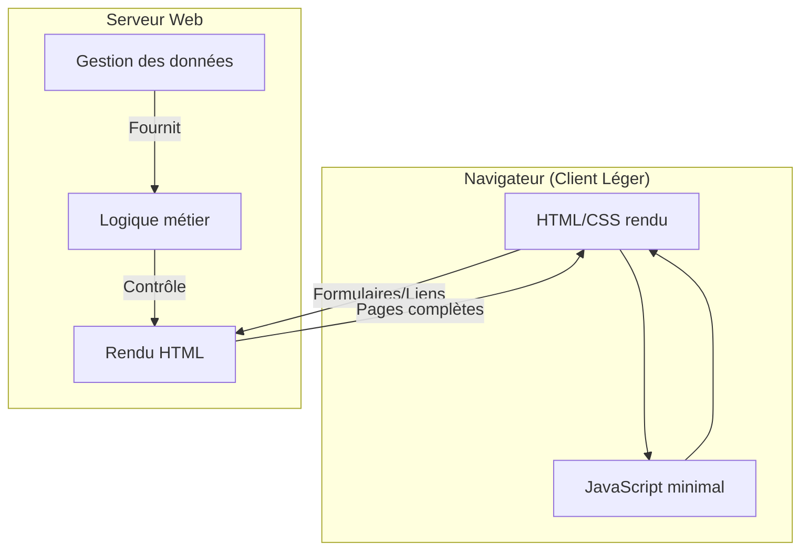
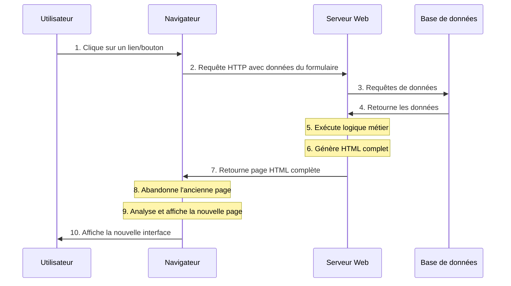

# Architecture Client-Serveur et Client Léger

## 1. Théorie

### 1.1 Architecture Client-Serveur

Le web fonctionne selon une architecture client-serveur où :
- Le **client** est l'application qui envoie des requêtes et utilise les ressources (généralement un navigateur web)
- Le **serveur** est l'application qui reçoit des requêtes et fournit des ressources (généralement une application comme Node.js, Apache, etc.)

Cette architecture constitue la base de presque toutes les applications web modernes.



#### Diagramme de séquence d'une interaction client-serveur basique



### 1.2 Client Léger (Thin Client)

Le client léger repose principalement sur le serveur pour le traitement et la génération des vues.

**Caractéristiques:**
- Interface utilisateur générée principalement côté serveur
- Logique métier et traitement des données principalement côté serveur
- Nécessite généralement un rechargement complet de la page pour les interactions
- Navigation par liens hypertextes et formulaires HTML standards
- État de l'application géré par le serveur (sessions, cookies)

**Exemples:** 
- Sites web traditionnels (avec peu de JavaScript), comme en Web1 BA1
- Applications web avec rendu côté serveur (Server-Side Rendering)
- Frameworks comme Django et Ruby on Rails (rendu traditionnel)



#### Client Léger : Cycle de vie d'une requête



**Points clés :**
- Chaque action requiert généralement un rechargement complet de la page
- Le serveur génère l'HTML complet pour chaque requête
- L'état de l'interface est géré côté serveur
- Consommation réseau plus importante (pages complètes)
- Plus simple à mettre en œuvre initialement

### 1.3 Avantages et inconvénients du Client Léger

| Aspect | Client Léger |
|--------|------------|
| Développement | Plus simple et rapide initialement |
| Maintenance | Centralisée principalement sur le serveur |
| Performances | Dépendantes du serveur et du réseau |
| Expérience utilisateur | Moins fluide (rechargements de page) |
| SEO[^1] | Excellent (tout est généré côté serveur) |
| Compatibilité | Très bonne même sur navigateurs anciens |
| Sécurité | Code critique reste sur le serveur |
| Consommation réseau | Plus élevée (pages complètes) |
| Charge serveur | Plus élevée (génération HTML) |
| Complexité du déploiement | Plus simple (mise à jour centralisée) |

[^1]: SEO : Search Engine Optimization, optimisation pour les moteurs de recherche (Google, Bing, etc.). Cela concerne donc la visibilité et le classement d'un site web dans les résultats de recherche.

## 2. Pratique : Mise en place d'un serveur web simple

Il est possible d'implémenter un serveur web en utilisant beaucoup de technologies différentes. Dans cette section, nous allons explorer un serveur web simple en utilisant Node.js et Express.js. Nous verrons plus tard comment le faire en PHP.

### 2.0 Prérequis

- Avoir Node.js installé sur votre machine (version 14 ou supérieure)
- Avoir un éditeur de code (comme Visual Studio Code)
- Connaissances de base en JavaScript et Node.js
- Connaissances de base en HTML et CSS


### 2.1 Serveur HTTP basique avec Node.js

Node.js permet de créer facilement un serveur HTTP basique. Commençons par un exemple minimal qui sert une page HTML simple.

```javascript
// Importer le module HTTP
const http = require('http');

// Créer un serveur HTTP
const server = http.createServer((req, res) => {
  // Définir les en-têtes de réponse
  res.setHeader('Content-Type', 'text/html');
  
  // Envoyer une réponse HTML simple
  res.end(`
    <!DOCTYPE html>
    <html>
      <head>
        <title>Serveur Simple</title>
      </head>
      <body>
        <h1>Bonjour du serveur!</h1>
        <p>Ceci est une page servie par notre serveur Node.js</p>
      </body>
    </html>
  `);
});

// Démarrer le serveur sur le port 3000
const PORT = 3000;
server.listen(PORT, () => {
  console.log(`Serveur démarré sur http://localhost:${PORT}`);
});
```

#### Exercice 1.1: Créer un serveur HTTP qui retourne différentes pages selon l'URL demandée

Dans cet exercice, modifiez le code pour servir différentes pages selon l'URL demandée.

### 2.2 Serveur avec Express.js

Express.js simplifie la création de serveurs HTTP en Node.js avec une API plus intuitive et des fonctionnalités supplémentaires.

```javascript
// Importer Express
const express = require('express');

// Créer une application Express
const app = express();

// Définir une route pour la page d'accueil
app.get('/', (req, res) => {
  res.send(`
    <!DOCTYPE html>
    <html>
      <head>
        <title>Serveur Express</title>
      </head>
      <body>
        <h1>Bonjour d'Express!</h1>
        <p>Ceci est une page servie par notre serveur Express</p>
        <ul>
          <li><a href="/about">À propos</a></li>
          <li><a href="/contact">Contact</a></li>
        </ul>
      </body>
    </html>
  `);
});

// Ajouter d'autres routes
app.get('/about', (req, res) => {
  res.send('<h1>À propos de nous</h1><p>Nous sommes une école qui enseigne le développement web.</p>');
});

app.get('/contact', (req, res) => {
  res.send('<h1>Contactez-nous</h1><p>Email: contact@exemple.com</p>');
});

// Gérer les routes inexistantes
app.use((req, res) => {
  res.status(404).send('<h1>404 - Page non trouvée</h1>');
});

// Démarrer le serveur
const PORT = 3000;
app.listen(PORT, () => {
  console.log(`Serveur Express démarré sur http://localhost:${PORT}`);
});
```

#### Exercice 1.2: Créer un serveur Express avec plusieurs routes et des modèles HTML

Dans cet exercice, étendez le serveur Express pour utiliser des fichiers de modèles HTML externes au lieu de chaînes de caractères intégrées dans le code.
