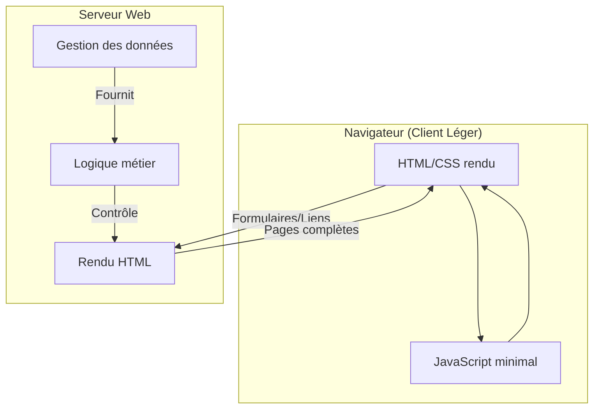
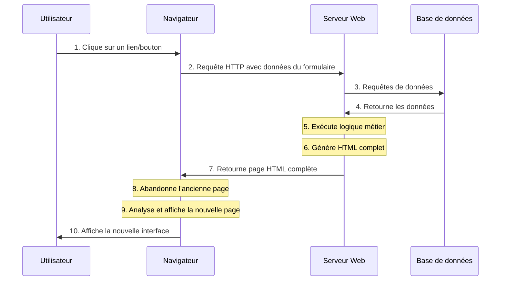
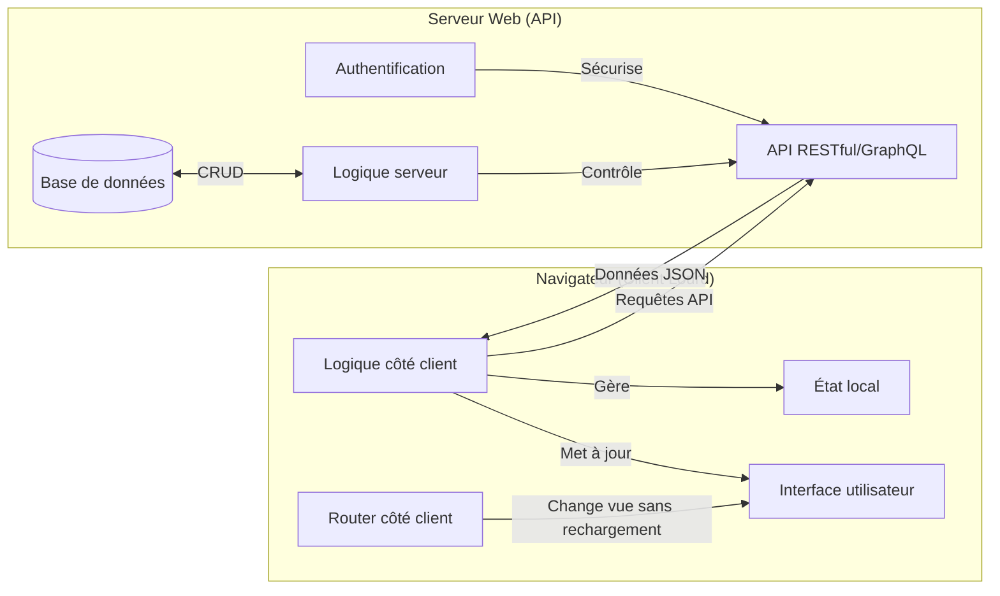
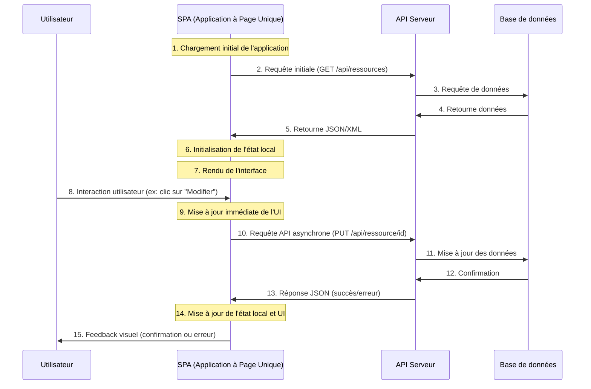
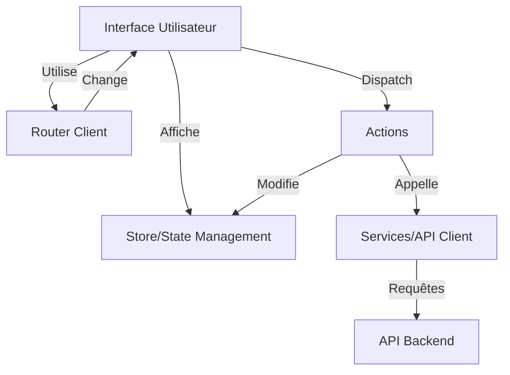

# Client léger vs Client lourd

Il y a deux grandes approches pour structurer une application web en fonction de la répartition des responsabilités entre le client (navigateur) et le serveur : 
- **Client Léger (Thin Client)** : La majorité du traitement et de la génération des vues se fait côté serveur. Le client est principalement responsable de l'affichage et de la capture des interactions utilisateur.
- **Client Lourd (Thick Client)** : La majorité du traitement et de la génération des vues se fait côté client. Le serveur fournit principalement des données via des API.

Nous allons présenter ici les caractéristiques, avantages et inconvénients de chaque approche.

## 1. Client Léger (Thin Client)

Le client léger repose principalement sur le serveur pour le traitement et la génération des vues.

**Caractéristiques:**
- Interface utilisateur générée principalement côté serveur
- Logique métier et traitement des données principalement côté serveur
- Nécessite généralement un rechargement complet de la page pour les interactions
- Navigation par liens hypertextes et formulaires HTML standards
- État de l'application géré par le serveur (sessions, cookies)

**Exemples:**
- Sites web traditionnels (avec peu de JavaScript), comme en Web1 BA1
- Applications web avec rendu côté serveur (Server-Side Rendering)
- Frameworks comme Django et Ruby on Rails (rendu traditionnel)

#### Client Léger : Cycle de vie d'une requête

**Points clés :**
- Chaque action requiert généralement un rechargement complet de la page
- Le serveur génère l'HTML complet pour chaque requête
- L'état de l'interface est géré côté serveur
- Consommation réseau plus importante (pages complètes)
- Plus simple à mettre en œuvre initialement

### 1.3 Avantages et inconvénients du Client Léger

| Aspect | Client Léger |
|--------|------------|
| Développement | Plus simple et rapide initialement |
| Maintenance | Centralisée principalement sur le serveur |
| Performances | Dépendantes du serveur et du réseau |
| Expérience utilisateur | Moins fluide (rechargements de page) |
| SEO[^1] | Excellent (tout est généré côté serveur) |
| Compatibilité | Très bonne même sur navigateurs anciens |
| Sécurité | Code critique reste sur le serveur |
| Consommation réseau | Plus élevée (pages complètes) |
| Charge serveur | Plus élevée (génération HTML) |
| Complexité du déploiement | Plus simple (mise à jour centralisée) |

[^1]: SEO : Search Engine Optimization, optimisation pour les moteurs de recherche (Google, Bing, etc.). Cela concerne donc la visibilité et le classement d'un site web dans les résultats de recherche.

## 2 Client Lourd (Rich Client)

Le client lourd délègue une part importante du traitement et de la logique au navigateur, créant des interfaces utilisateur plus riches et interactives.

**Caractéristiques:**
- Interface utilisateur riche et interactive, construite avec JavaScript
- Logique métier partiellement déplacée côté client
- Mise à jour dynamique de l'interface sans rechargement complet
- Communication avec le serveur principalement via API (REST, GraphQL)
- État temporaire maintenu côté client (state management)
- Applications à page unique (SPA - Single Page Applications)

**Exemples:**
- Applications web modernes développées avec React, Vue.js, Angular
- Applications mobiles web (PWA - Progressive Web Apps)
- Dashboards interactifs

### 2.1 Cycle de vie d'une requête dans un Client Lourd

**Points clés :**
- Une seule page initiale chargée, ensuite mises à jour dynamiques
- Communication asynchrone avec l'API serveur
- État maintenu côté client dans des stores/gestionnaires d'état
- Consommation réseau optimisée (uniquement les données nécessaires)
- Expérience utilisateur plus fluide (pas de rechargement)
- Développement plus complexe (gestion d'état, routage client, etc.)

### 2.2. Architecture des Applications Client Lourd

Une application client lourd typique s'organise autour de plusieurs couches :

#### Éléments clés :

1. **Interface Utilisateur** : Composants d'interface qui affichent les données et gèrent les interactions utilisateur.
2. **State Management** : Gestion centralisée de l'état de l'application (Redux, Vuex, Context API).
3. **Services** : Couche d'abstraction pour les appels API et les fonctionnalités partagées.
4. **Router** : Gestion de la navigation et des "vues" sans rechargement de page.
5. **Actions/Events** : Flux de données et déclencheurs d'événements pour les mises à jour d'état.

## 3. Comparaison entre Client Léger et Client Lourd

| Aspect | Client Léger | Client Lourd |
|--------|------------|------------|
| Développement | Plus simple et rapide initialement | Plus complexe, nécessite plus de structure |
| Maintenance | Centralisée principalement sur le serveur | Répartie entre client et serveur |
| Performances | Dépendantes du serveur et du réseau | Meilleures après chargement initial |
| Expérience utilisateur | Moins fluide (rechargements de page) | Plus réactive et immersive |
| SEO | Excellent (tout est généré côté serveur) | Problématique sans SSR/techniques spécifiques |
| Compatibilité | Très bonne même sur navigateurs anciens | Peut nécessiter des polyfills/transpilation |
| Sécurité | Code critique reste sur le serveur | Plus de code exposé côté client |
| Consommation réseau | Plus élevée (pages complètes) | Moindre après chargement initial (uniquement data) |
| Charge serveur | Plus élevée (génération HTML) | Moindre (uniquement API data) |
| Complexité du déploiement | Plus simple (mise à jour centralisée) | Plus complexe (assets client + API) |

### 3.1 Quand choisir un Client Lourd?

Le client lourd est particulièrement adapté dans les situations suivantes :

1. **Applications hautement interactives** nécessitant des mises à jour fréquentes de l'interface.
2. **Interfaces complexes** avec de nombreuses interactions utilisateur et des transitions.
3. **Applications avec état** où l'utilisateur effectue plusieurs opérations liées.
4. **Expérience utilisateur prioritaire** sur des connexions stables.
5. **Applications métier internes** où le SEO n'est pas une priorité.

