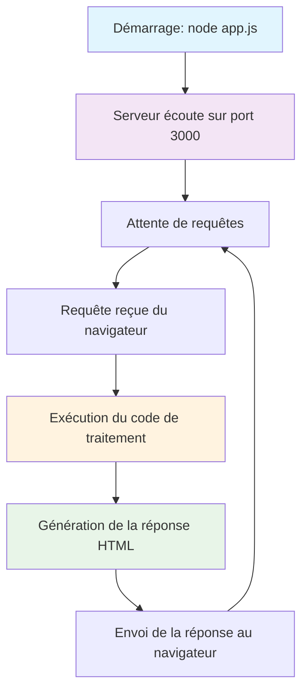
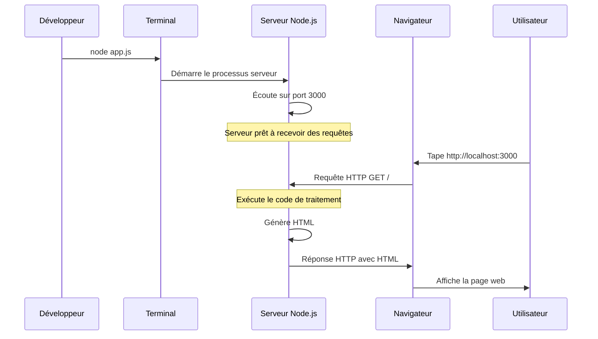
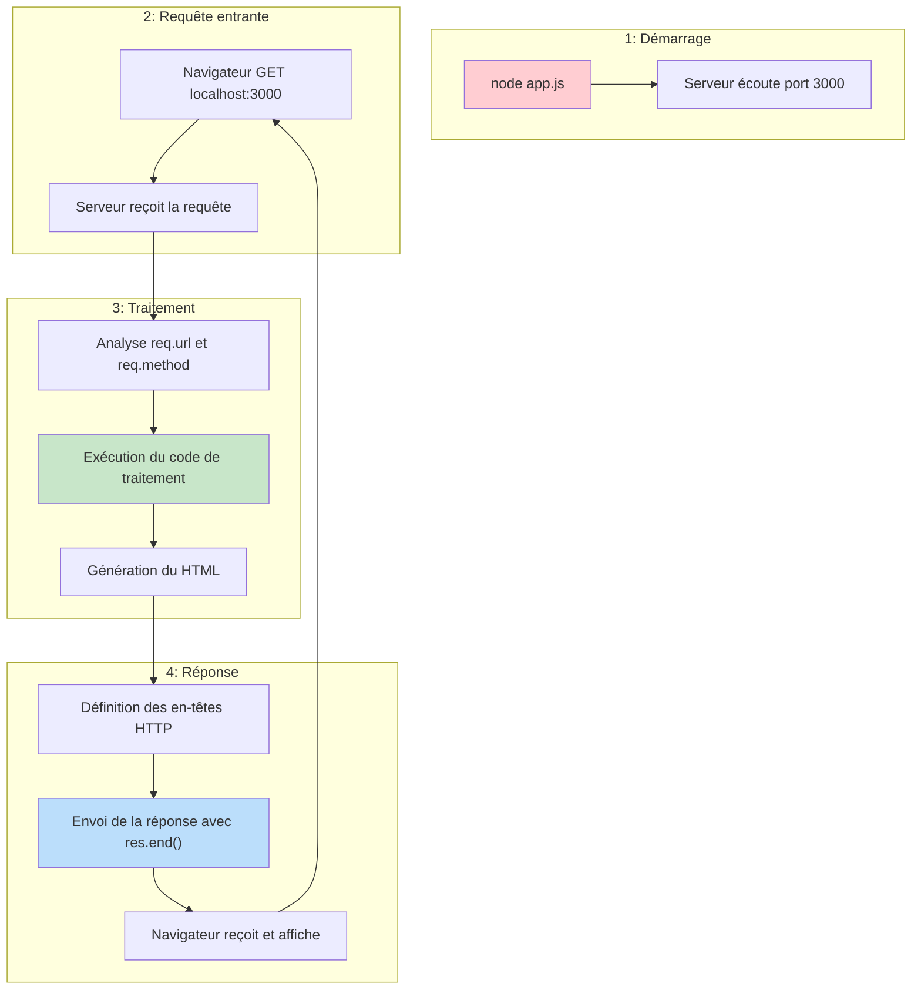

# Serveurs Web avec Node.js et Express.js

## 1. Introduction

Dans cette séance, nous allons apprendre à créer des serveurs web en utilisant Node.js et le framework Express.js. Nous explorerons comment créer des applications web côté serveur qui implémentent l'architecture client léger vue précédemment.

## 2. Prérequis

- Avoir Node.js installé sur votre machine (version 14 ou supérieure)
- Avoir un éditeur de code (comme Visual Studio Code ou WebStorm)
- Connaissances en JavaScript, HTML et CSS
- Compréhension de l'architecture client-serveur et du protocole HTTP

## 3. Environnement d'exécution Node.js

### 3.1 Comprendre l'exécution côté serveur

Contrairement au JavaScript que vous avez pu utiliser dans le navigateur (côté client), le code que nous écrivons maintenant s'exécute sur le **serveur** dans l'environnement **Node.js**. Voici les étapes d'exécution :

1. **Démarrage du serveur** : Quand vous exécutez `node app.js`, Node.js démarre un processus serveur
2. **Écoute du port** : Le serveur commence à "écouter" sur un port spécifique (comme le port 3000)
3. **Attente des requêtes** : Le serveur reste en vie et attend que des clients (navigateurs) lui envoient des requêtes
4. **Traitement des requêtes** : Pour chaque requête reçue, le serveur exécute le code approprié
5. **Envoi des réponses** : Le serveur génère et renvoie une réponse au client



### 3.2 Cycle de vie d'une requête HTTP dans Node.js



## 4. Serveur HTTP basique avec Node.js

### 4.1 Premier serveur HTTP

Node.js permet de créer facilement un serveur HTTP basique. Commençons par un exemple minimal qui sert une page HTML simple.

```javascript
// Importer le module HTTP
const http = require('http');

// Créer un serveur HTTP
const server = http.createServer((req, res) => {
  // Définir les en-têtes de réponse
  res.setHeader('Content-Type', 'text/html');
  
  // Envoyer une réponse HTML simple
  res.end(`
    <!DOCTYPE html>
    <html>
      <head>
        <title>Serveur Simple</title>
      </head>
      <body>
        <h1>Bonjour du serveur!</h1>
        <p>Ceci est une page servie par notre serveur Node.js</p>
      </body>
    </html>
  `);
});

// Démarrer le serveur sur le port 3000
const PORT = 3000;
server.listen(PORT, () => {
  console.log(`Serveur démarré sur http://localhost:${PORT}`);
});
```

### 4.2 Comment notre code Node.js traite HTTP

Dans notre serveur Node.js, voici ce qui se passe :

```javascript
const server = http.createServer((req, res) => {
  // req = objet représentant la requête HTTP reçue
  // res = objet pour construire et envoyer la réponse HTTP
  
  // Analyse de la requête
  console.log('Méthode:', req.method);      // GET, POST, etc.
  console.log('URL:', req.url);             // /accueil, /contact, etc.
  console.log('En-têtes:', req.headers);    // Tous les en-têtes
  
  // Construction de la réponse
  res.setHeader('Content-Type', 'text/html'); // Définit le type de contenu
  res.statusCode = 200;                        // Définit le code de statut
  res.end('<h1>Hello World!</h1>');           // Envoie le corps et termine
});
```

### 4.3 Flux complet dans notre application



### 4.4 Les limites de `http.createServer`

Bien que le module HTTP natif de Node.js soit fonctionnel, il présente des limitations importantes quand on souhaite créer des applications web plus complexes. Voici un exemple qui illustre ces difficultés :

```javascript
const http = require('http');
const url = require('url');

const server = http.createServer((req, res) => {
  // Parser l'URL et la méthode HTTP
  const parsedUrl = url.parse(req.url, true);
  const path = parsedUrl.pathname;
  const method = req.method;
  
  // Définir les en-têtes de base
  res.setHeader('Content-Type', 'text/html; charset=utf-8');
  
  // Gérer les différentes routes manuellement
  if (method === 'GET' && path === '/') {
    res.statusCode = 200;
    res.end('<h1>Accueil</h1><a href="/about">À propos</a> | <a href="/contact">Contact</a>');
  } 
  else if (method === 'GET' && path === '/about') {
    res.statusCode = 200;
    res.end('<h1>À propos</h1><p>Informations sur notre site</p>');
  } 
  else if (method === 'GET' && path === '/contact') {
    res.statusCode = 200;
    res.end('<h1>Contact</h1><form method="POST" action="/contact"><input type="text" name="message" placeholder="Votre message"><button type="submit">Envoyer</button></form>');
  } 
  else if (method === 'POST' && path === '/contact') {
    // Gérer les données POST devient très complexe
    let body = '';
    req.on('data', chunk => {
      body += chunk.toString();
    });
    req.on('end', () => {
      res.statusCode = 200;
      res.end('<h1>Message reçu!</h1><p>Merci pour votre message.</p>');
    });
  } 
  else {
    // Page 404
    res.statusCode = 404;
    res.end('<h1>404 - Page non trouvée</h1>');
  }
});

server.listen(3000, () => {
  console.log('Serveur démarré sur http://localhost:3000');
});
```

**Problèmes identifiés avec cette approche :**

1. **Code verbeux et répétitif** : Chaque route nécessite une condition `if/else`
2. **Gestion manuelle du parsing** : URLs, paramètres, et données POST doivent être parsés manuellement
3. **Pas de middleware** : Impossible de réutiliser facilement du code commun (authentification, logs, etc.)
4. **Gestion d'erreurs complexe** : Chaque cas d'erreur doit être géré individuellement
5. **Maintenance difficile** : Plus on ajoute de routes, plus le code devient ingérable
6. **Pas de support intégré** : Cookies, sessions, fichiers statiques nécessitent du code personnalisé

## 5. Introduction à Express.js

### 5.1 Qu'est-ce qu'Express.js ?

Express.js est un framework web minimaliste et flexible pour Node.js qui fournit un ensemble robuste de fonctionnalités pour les applications web et mobiles. Il simplifie la création de serveurs HTTP en Node.js avec une API plus intuitive et des fonctionnalités supplémentaires.

**Avantages d'Express.js :**
- Syntaxe simple et intuitive
- Système de routage puissant
- Support des middleware
- Gestion facilitée des requêtes et réponses
- Grande communauté et écosystème riche

### 5.2 Installation d'Express.js

Pour utiliser Express.js dans votre projet, vous devez d'abord l'installer via npm :

```bash
# Initialiser un projet Node.js
npm init -y

# Installer Express.js
npm install express
```

### 5.3 Premier serveur Express

Voici le même serveur que précédemment, mais réécrit avec Express.js :

```javascript
// Importer Express
const express = require('express');

// Créer une application Express
const app = express();

// Définir une route pour la page d'accueil
app.get('/', (req, res) => {
  res.send(`
    <!DOCTYPE html>
    <html>
      <head>
        <title>Serveur Express</title>
      </head>
      <body>
        <h1>Bonjour d'Express!</h1>
        <p>Ceci est une page servie par notre serveur Express</p>
        <ul>
          <li><a href="/about">À propos</a></li>
          <li><a href="/contact">Contact</a></li>
        </ul>
      </body>
    </html>
  `);
});

// Ajouter d'autres routes
app.get('/about', (req, res) => {
  res.send('<h1>À propos de nous</h1><p>Nous sommes une école qui enseigne le développement web.</p>');
});

app.get('/contact', (req, res) => {
  res.send('<h1>Contactez-nous</h1><p>Email: contact@exemple.com</p>');
});

// Gérer les routes inexistantes
app.use((req, res) => {
  res.status(404).send('<h1>404 - Page non trouvée</h1>');
});

// Démarrer le serveur
const PORT = 3000;
app.listen(PORT, () => {
  console.log(`Serveur Express démarré sur http://localhost:${PORT}`);
});
```

**Comparaison avec Node.js pur :**
- Code beaucoup plus concis et lisible
- Pas besoin de parser manuellement les URLs
- Gestion automatique des en-têtes HTTP basiques
- Syntaxe intuitive pour définir les routes

## 6. Routage avec Express.js

Le **routage** fait référence à la définition de la manière dont une application répond aux requêtes des clients vers des points de terminaison spécifiques (endpoints). Chaque endpoint est défini par un **chemin** (path) et une **méthode HTTP** spécifique (GET, POST, PUT, DELETE, etc.).

Dans Express.js, une route basique a la structure suivante :
```
app.MÉTHODE(PATH, HANDLER)
```

Où :
- `app` est une instance d'Express
- `MÉTHODE` est une méthode HTTP en minuscules (get, post, put, delete, etc.)
- `PATH` est le chemin sur le serveur (comme `/users`, `/contact`, etc.)
- `HANDLER` est la fonction exécutée quand la route correspond à la requête

### 6.1 Méthodes de routage

Express.js supporte toutes les méthodes HTTP principales correspondant aux opérations CRUD (Create, Read, Update, Delete). Chaque méthode a un rôle bien défini dans l'architecture REST :

- **GET** : Utilisé pour **récupérer** des données sans les modifier (opération de lecture)
- **POST** : Utilisé pour **créer** de nouvelles ressources (envoi de données au serveur)
- **PUT** : Utilisé pour **mettre à jour complètement** une ressource existante
- **DELETE** : Utilisé pour **supprimer** une ressource

```javascript
// GET - Récupérer des données
app.get('/users', (req, res) => {
  res.send('Liste des utilisateurs');
});

// POST - Créer de nouvelles données
app.post('/users', (req, res) => {
  res.send('Créer un nouvel utilisateur');
});

// PUT - Mettre à jour des données
app.put('/users/:id', (req, res) => {
  res.send(`Mettre à jour l'utilisateur ${req.params.id}`);
});

// DELETE - Supprimer des données
app.delete('/users/:id', (req, res) => {
  res.send(`Supprimer l'utilisateur ${req.params.id}`);
});
```

**Exemple concret d'utilisation :**
- `GET /users` → Afficher la liste de tous les utilisateurs
- `POST /users` → Créer un nouvel utilisateur avec les données du formulaire
- `PUT /users/123` → Modifier complètement l'utilisateur avec l'ID 123
- `DELETE /users/123` → Supprimer l'utilisateur avec l'ID 123

### 6.2 Paramètres de route

Les **paramètres de route** permettent de créer des URLs dynamiques où certaines parties peuvent varier. Dans Express, ils sont définis avec le préfixe `:` et sont automatiquement capturés dans l'objet `req.params`.

Cette fonctionnalité est essentielle pour créer des APIs flexibles qui peuvent traiter différentes ressources avec la même logique de base.

```javascript
// Paramètre simple
app.get('/users/:id', (req, res) => {
  const userId = req.params.id;
  res.send(`Profil de l'utilisateur ${userId}`);
});

// Plusieurs paramètres
app.get('/users/:userId/posts/:postId', (req, res) => {
  const { userId, postId } = req.params;
  res.send(`Post ${postId} de l'utilisateur ${userId}`);
});

// Paramètres optionnels
app.get('/products/:category?', (req, res) => {
  const category = req.params.category || 'tous';
  res.send(`Produits de la catégorie: ${category}`);
});
```

**Explications détaillées :**

1. **Paramètre simple** : `:id` capture n'importe quelle valeur après `/users/`
   - URL `/users/123` → `req.params.id` vaut `"123"`
   - URL `/users/jean` → `req.params.id` vaut `"jean"`

2. **Plusieurs paramètres** : Permet de créer des URLs hiérarchiques
   - URL `/users/123/posts/456` → `req.params.userId` = `"123"`, `req.params.postId` = `"456"`
   - Pratique pour naviguer dans des ressources imbriquées

3. **Paramètres optionnels** : Le `?` après `:category` rend ce paramètre facultatif
   - URL `/products` → `category` vaut `"tous"` (valeur par défaut)
   - URL `/products/electronique` → `category` vaut `"electronique"`

### 6.3 Query parameters (Paramètres de requête)

Les **query parameters** sont des paramètres passés dans l'URL après le symbole `?`. Ils sont particulièrement utiles pour :
- **Filtrer** des résultats (ex: par catégorie, prix, date)
- **Paginer** des listes longues
- **Trier** des données
- **Configurer** l'affichage

Express parse automatiquement ces paramètres et les rend disponibles dans l'objet `req.query`.

```javascript
// URL: /search?q=nodejs&limit=10&sort=date
app.get('/search', (req, res) => {
  const { q, limit, sort } = req.query;
  res.send(`Recherche: "${q}", Limite: ${limit}, Tri: ${sort}`);
});
```

**Exemples d'URLs et leurs paramètres :**
- `/search?q=javascript` → `req.query = { q: "javascript" }`
- `/search?q=nodejs&limit=5` → `req.query = { q: "nodejs", limit: "5" }`
- `/search?q=express&limit=10&sort=date&category=tutorial` → `req.query = { q: "express", limit: "10", sort: "date", category: "tutorial" }`

**Note importante :** Tous les query parameters sont des **chaînes de caractères**. Si vous avez besoin d'un nombre, pensez à le convertir avec `parseInt()` ou `Number()`.

```javascript
app.get('/products', (req, res) => {
  const page = parseInt(req.query.page) || 1; // Conversion en nombre avec valeur par défaut
  const limit = parseInt(req.query.limit) || 10;
  
  res.send(`Page ${page}, ${limit} produits par page`);
});
```

### 6.4 Combinaison de paramètres de route et query parameters

Il est courant de combiner les deux types de paramètres pour créer des APIs très flexibles :

```javascript
// URL: /users/123/posts?limit=5&sort=recent
app.get('/users/:userId/posts', (req, res) => {
  const userId = req.params.userId;        // Paramètre de route
  const limit = req.query.limit || 10;     // Query parameter
  const sort = req.query.sort || 'date';   // Query parameter
  
  res.send(`Posts de l'utilisateur ${userId}, limite: ${limit}, tri: ${sort}`);
});
```

Cette approche permet de créer des URLs expressives et intuitives qui reflètent la structure hiérarchique des données tout en offrant des options de personnalisation.
