# Séance 1 : Architecture Client-Serveur et Développement Web

## 1. Théorie

### 1.1 Architecture Client-Serveur

Le web fonctionne selon une architecture client-serveur où :
- Le **client** est l'application qui envoie des requêtes et utilise les ressources (généralement un navigateur web)
- Le **serveur** est l'application qui reçoit des requêtes et fournit des ressources (généralement une application comme Node.js, Apache, etc.)

Cette architecture constitue la base de presque toutes les applications web modernes.

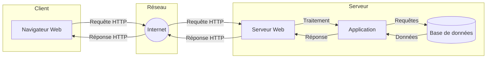

#### Diagramme de séquence d'une interaction client-serveur basique

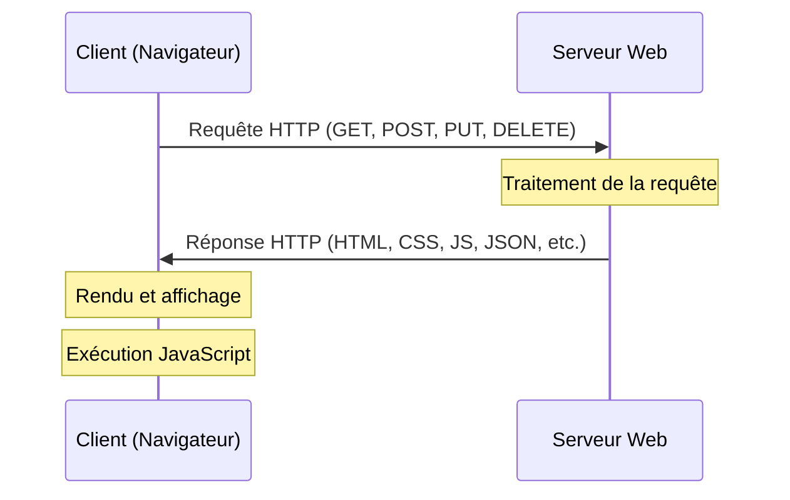

### 1.2 Client Léger vs Client Lourd

Le choix entre client léger et client lourd est une décision architecturale fondamentale qui influence le développement, les performances et l'expérience utilisateur de votre application web.

#### Client Léger (Thin Client)

Le client léger repose principalement sur le serveur pour le traitement et la génération des vues.

**Caractéristiques:**
- Interface utilisateur générée principalement côté serveur
- Logique métier et traitement des données principalement côté serveur
- Nécessite généralement un rechargement complet de la page pour les interactions
- Navigation par liens hypertextes et formulaires HTML standards
- État de l'application géré par le serveur (sessions, cookies)

**Exemples:** 
- Sites web traditionnels (avec peu de JavaScript)
- Applications web avec rendu côté serveur (Server-Side Rendering)
- Frameworks comme Django et Ruby on Rails (rendu traditionnel)

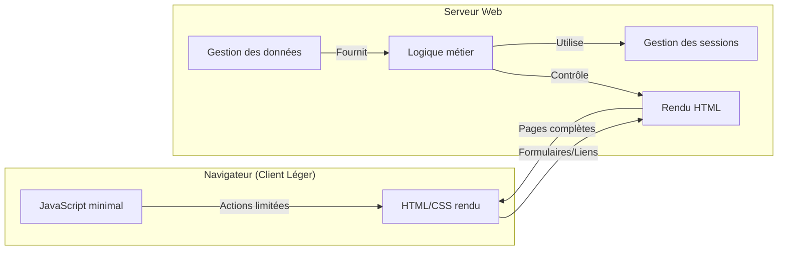

#### Client Lourd (Rich Client)

Le client lourd délègue une part importante du traitement et de la logique au navigateur.

**Caractéristiques:**
- Interface utilisateur riche et interactive, construite avec JavaScript
- Logique métier partiellement déplacée côté client
- Mise à jour dynamique de l'interface sans rechargement complet
- Communication avec le serveur principalement via API (REST, GraphQL)
- État temporaire maintenu côté client (state management)
- Applications à page unique (SPA - Single Page Applications)

**Exemples:**
- Applications web modernes développées avec React, Vue.js, Angular
- Applications mobiles web (PWA - Progressive Web Apps)
- Dashboards interactifs

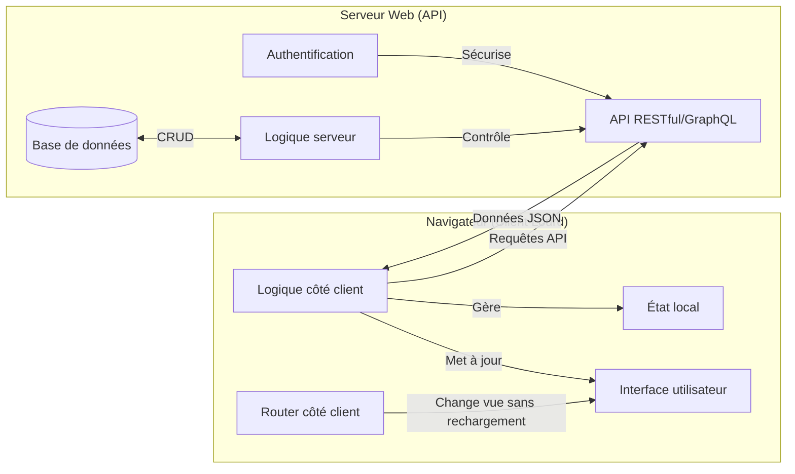

### 1.3 Comparaison détaillée des interactions client-serveur

#### Client Léger : Cycle de vie d'une requête

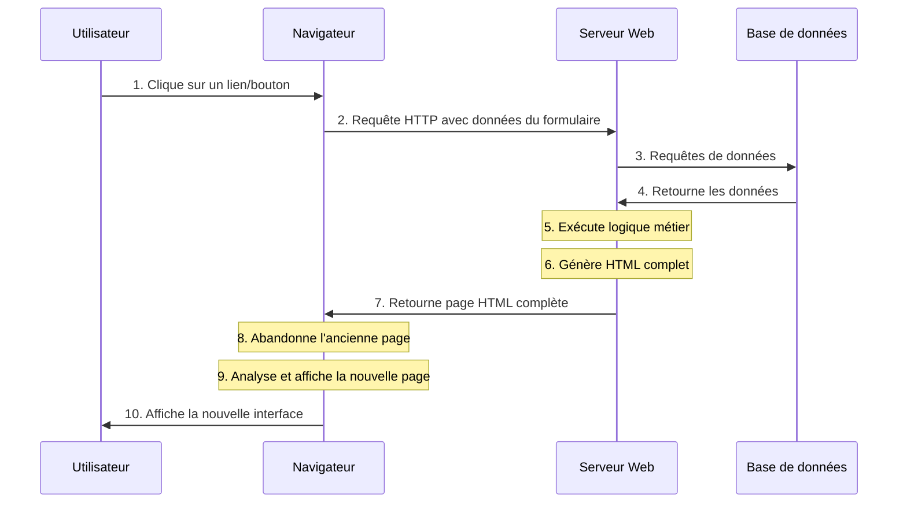

**Points clés :**
- Chaque action requiert généralement un rechargement complet de la page
- Le serveur génère l'HTML complet pour chaque requête
- L'état de l'interface est géré côté serveur
- Consommation réseau plus importante (pages complètes)
- Plus simple à mettre en œuvre initialement

#### Client Lourd : Cycle de vie d'une requête

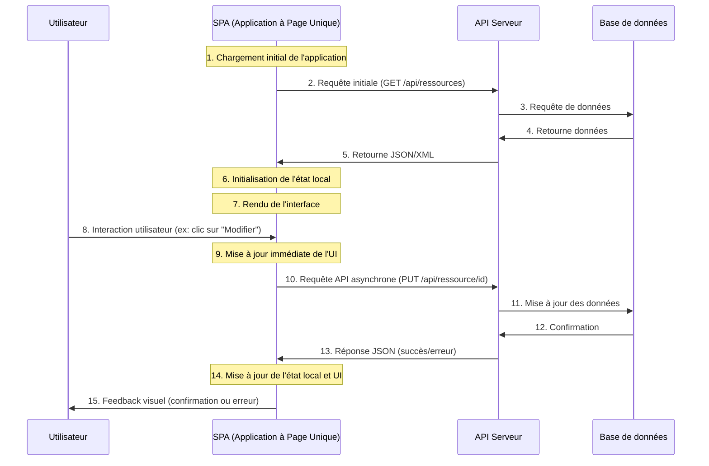

**Points clés :**
- Une seule page initiale chargée, ensuite mises à jour dynamiques
- Communication asynchrone avec l'API serveur
- État maintenu côté client dans des stores/gestionnaires d'état
- Consommation réseau optimisée (uniquement les données nécessaires)
- Expérience utilisateur plus fluide (pas de rechargement)
- Développement plus complexe (gestion d'état, routage client, etc.)

### 1.4 Avantages et inconvénients

| Aspect | Client Léger | Client Lourd |
|--------|------------|------------|
| **Complexité** | Plus simple côté client | Plus complexe côté client |
| **Charge serveur** | Plus élevée (rendu HTML) | Réduite (API uniquement) |
| **Expérience utilisateur** | Rechargements visibles | Plus fluide, sans rechargement |
| **Bande passante** | Consommation plus élevée | Optimisation possible |
| **Performance perçue** | Dépend du réseau | Meilleure après chargement initial |
| **SEO** | Naturellement optimisé | Nécessite techniques supplémentaires (SSR) |
| **Accessibilité** | Souvent meilleure | Requiert plus d'attention |
| **État application** | Géré côté serveur | Géré côté client |
| **Développement** | Découplé (front/back) | Plus intégré |

### 1.5 Introduction à Node.js et Express

#### Node.js : Plateforme serveur JavaScript

**Node.js** est une plateforme construite sur le moteur JavaScript V8 de Chrome qui permet d'exécuter du code JavaScript côté serveur.

**Caractéristiques principales :**
- **I/O non-bloquant** : Gestion asynchrone des opérations d'entrée/sortie
- **Modèle événementiel** : Architecture basée sur des événements et des callbacks
- **Single-thread** : Un seul thread principal avec boucle d'événements (event loop)
- **NPM** : Gestionnaire de paquets avec un vaste écosystème de librairies
- **JavaScript universel** : Même langage côté client et serveur

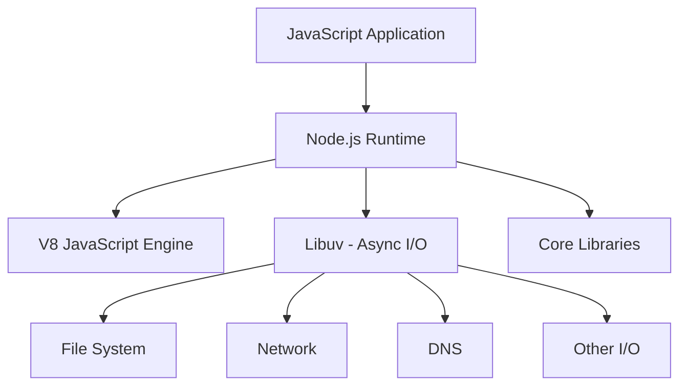

#### Express : Framework web minimaliste

**Express.js** est un framework web minimaliste et flexible pour Node.js qui simplifie le développement d'applications web et d'API.

**Fonctionnalités clés :**
- **Routage HTTP** : Gestion des routes et méthodes HTTP (GET, POST, etc.)
- **Middleware** : Système de fonctions intermédiaires pour traiter les requêtes
- **Templating** : Support pour divers moteurs de templates (EJS, Pug, Handlebars)
- **Statique** : Servir facilement des fichiers statiques (CSS, JS, images)
- **Extensible** : Architecture modulaire facilement extensible

**Architecture middleware d'Express :**

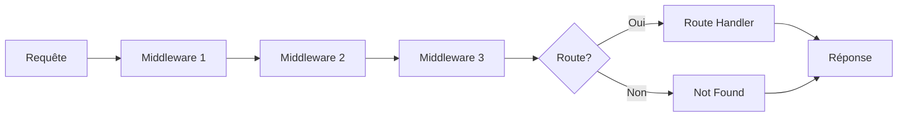

**Avantages de Node.js + Express :** 
- **Performance** : Traitement rapide des requêtes grâce au modèle non-bloquant
- **Scalabilité** : Gestion efficace de nombreuses connexions simultanées
- **JavaScript universel** : Expérience de développement unifiée front-end/back-end
- **Écosystème riche** : Nombreuses bibliothèques et outils disponibles
- **Polyvalence** : Adapté aux API RESTful, applications en temps réel et applications web traditionnelles
- **Idéal pour les deux architectures** : Peut servir efficacement des clients légers et lourds

## 2. Application pratique

Dans cette section, nous allons examiner comment implémenter concrètement les deux approches client-serveur (client léger et client lourd) au sein d'une même application Node.js/Express.

### 2.1 Implémentation d'un serveur polyvalent avec Node.js/Express

Notre application d'exemple est un système de gestion d'utilisateurs qui implémente les deux approches simultanément :

1. **Mode client léger** - Pages HTML complètement générées par le serveur
2. **Mode client lourd** - Application à page unique (SPA) + API REST

#### Structure du projet

```
seance1/
├── app.js                # Serveur Express principal
├── package.json          # Configuration du projet
└── public/               # Fichiers statiques
    ├── index.html        # Page d'accueil SPA
    ├── css/
    │   └── style.css     # Styles CSS
    └── js/
        └── app.js        # JavaScript côté client (SPA)
```

#### Configuration du serveur

::: details Code complet du serveur Express
```javascript
// Importation des modules nécessaires
const express = require('express');
const path = require('path');
const app = express();

// Configuration des middleware
app.use(express.json());                                     // Pour parser le JSON des requêtes
app.use(express.static(path.join(__dirname, 'public')));     // Pour servir les fichiers statiques

// Base de données simulée (en mémoire)
let users = [
  { id: 1, name: "Alice Smith", email: "alice@example.com", role: "Admin" },
  { id: 2, name: "Bob Johnson", email: "bob@example.com", role: "User" },
  { id: 3, name: "Charlie Brown", email: "charlie@example.com", role: "User" }
];

// ------------------ ROUTES POUR CLIENT LÉGER ------------------
// Ces routes génèrent des pages HTML complètes côté serveur

app.get('/thin', (req, res) => {
  // Génération complète de la page HTML côté serveur
  let html = `
    <!DOCTYPE html>
    <html>
    <head>
      <title>Client Léger</title>
      <link rel="stylesheet" href="/css/style.css">
    </head>
    <body>
      <h1>Liste d'utilisateurs (Client Léger)</h1>
      <p>Cette page est entièrement générée par le serveur</p>
      <table>
        <thead>
          <tr>
            <th>ID</th><th>Nom</th><th>Email</th><th>Rôle</th><th>Actions</th>
          </tr>
        </thead>
        <tbody>`;
  
  // Génération dynamique du tableau d'utilisateurs
  users.forEach(user => {
    html += `
          <tr>
            <td>${user.id}</td>
            <td>${user.name}</td>
            <td>${user.email}</td>
            <td>${user.role}</td>
            <td>
              <a href="/thin/users/${user.id}">Voir</a>
            </td>
          </tr>`;
  });
  
  html += `
        </tbody>
      </table>
      <p><a href="/">Retour à l'accueil</a></p>
    </body>
    </html>`;
  
  // Envoi de la page HTML complète
  res.send(html);
});

app.get('/thin/users/:id', (req, res) => {
  // Recherche de l'utilisateur par ID
  const user = users.find(u => u.id === parseInt(req.params.id));
  
  // Gestion du cas où l'utilisateur n'existe pas
  if (!user) {
    return res.status(404).send(`
      <!DOCTYPE html>
      <html>
        <head>
          <title>Erreur</title>
          <link rel="stylesheet" href="/css/style.css">
        </head>
        <body>
          <h1>Erreur 404</h1>
          <p>Utilisateur non trouvé</p>
          <p><a href="/thin">Retour à la liste</a></p>
        </body>
      </html>`);
  }
  
  // Génération de la page de détails
  let html = `
    <!DOCTYPE html>
    <html>
    <head>
      <title>Détails de l'utilisateur</title>
      <link rel="stylesheet" href="/css/style.css">
    </head>
    <body>
      <h1>Détails de l'utilisateur</h1>
      <div class="user-details">
        <p><strong>ID:</strong> ${user.id}</p>
        <p><strong>Nom:</strong> ${user.name}</p>
        <p><strong>Email:</strong> ${user.email}</p>
        <p><strong>Rôle:</strong> ${user.role}</p>
      </div>
      <p><a href="/thin">Retour à la liste</a></p>
    </body>
    </html>`;
  
  res.send(html);
});

// ------------------ ROUTES POUR CLIENT LOURD (API) ------------------
// Ces routes renvoient uniquement des données JSON pour l'API

// GET - Liste des utilisateurs
app.get('/api/users', (req, res) => {
  res.json(users);
});

// GET - Détails d'un utilisateur
app.get('/api/users/:id', (req, res) => {
  const user = users.find(u => u.id === parseInt(req.params.id));
  
  if (!user) {
    return res.status(404).json({ error: 'Utilisateur non trouvé' });
  }
  
  res.json(user);
});

// POST - Création d'un nouvel utilisateur
app.post('/api/users', (req, res) => {
  const { name, email, role } = req.body;
  
  if (!name || !email) {
    return res.status(400).json({ error: 'Nom et email requis' });
  }
  
  const newUser = {
    id: users.length > 0 ? Math.max(...users.map(u => u.id)) + 1 : 1,
    name,
    email,
    role: role || 'User'
  };
  
  users.push(newUser);
  res.status(201).json(newUser);
});

// Autres routes API (PUT, DELETE)...

// Route principale pour servir l'application client lourd
app.get('/', (req, res) => {
  res.sendFile(path.join(__dirname, 'public', 'index.html'));
});

// Démarrage du serveur
const PORT = process.env.PORT || 3000;
app.listen(PORT, () => {
  console.log(`Serveur démarré sur http://localhost:${PORT}`);
});
```
:::

#### Points clés de l'implémentation

**Configuration d'Express :**
- `express.json()` - Middleware pour analyser le corps des requêtes JSON
- `express.static()` - Middleware pour servir les fichiers statiques du dossier public

**Approche client léger :**
- Routes définies sous `/thin`
- Génération complète des pages HTML côté serveur avec des templates littéraux
- Navigation par liens hypertextes traditionnels
- Rechargement complet à chaque interaction

**Approche client lourd :**
- API RESTful définie sous `/api`
- Échange de données au format JSON
- Gestion des erreurs avec codes HTTP appropriés
- Page principale servie statiquement (`index.html`)

### 2.2 Comparaison concrète des approches

Examinons en détail comment les deux approches fonctionnent dans notre application exemple.

#### Client Léger : Analyse technique

**Cycle de vie d'une requête :**

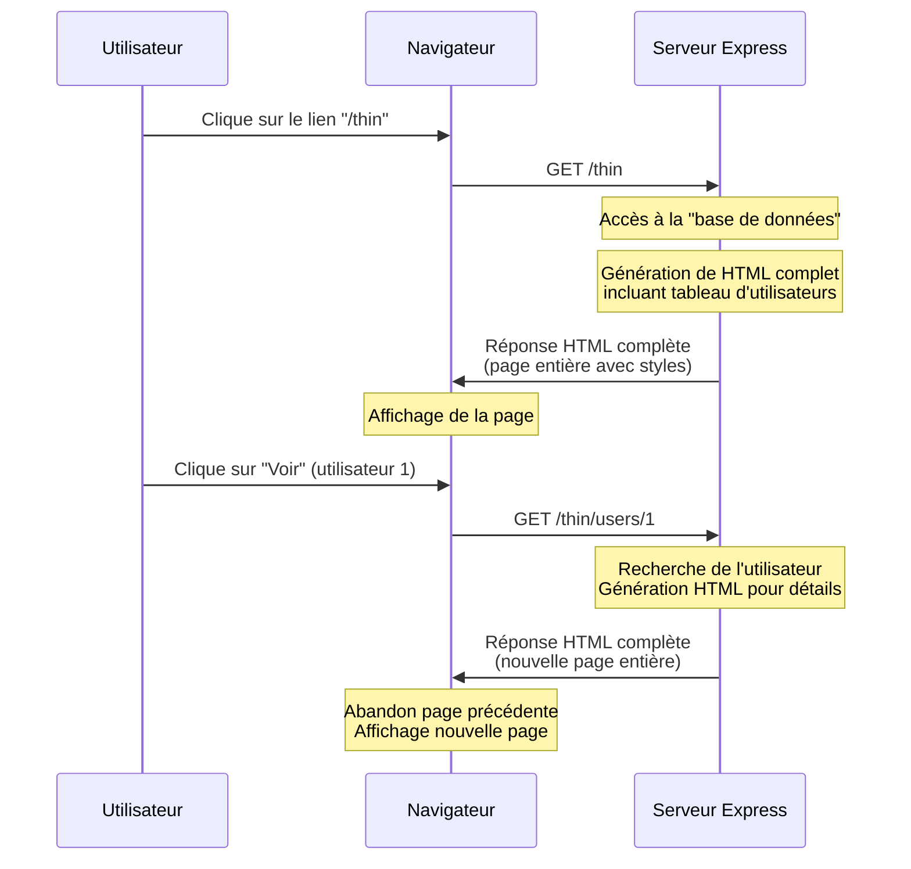

**Impact technique :**
- **Charge serveur** : Plus élevée (génération HTML complète)
- **Trafic réseau** : Pages HTML complètes à chaque requête
- **État client** : Minimal, principalement côté serveur

**Exemple illustré :**

::: info Client Léger - Vue d'ensemble
1. Utilisateur accède à `/thin`
2. Serveur construit une page HTML complète avec tous les utilisateurs :
   ```html
   <!DOCTYPE html>
   <html>
   <head>
     <title>Client Léger</title>
     <link rel="stylesheet" href="/css/style.css">
   </head>
   <body>
     <h1>Liste d'utilisateurs (Client Léger)</h1>
     <table>
       <tr><td>1</td><td>Alice Smith</td><td>alice@example.com</td>...</tr>
       <tr><td>2</td><td>Bob Johnson</td><td>bob@example.com</td>...</tr>
       <!-- ... -->
     </table>
   </body>
   </html>
   ```
3. Chaque clic génère une nouvelle page HTML complète


:::

#### Client Lourd (SPA) : Analyse technique

**Cycle de vie d'une requête :**

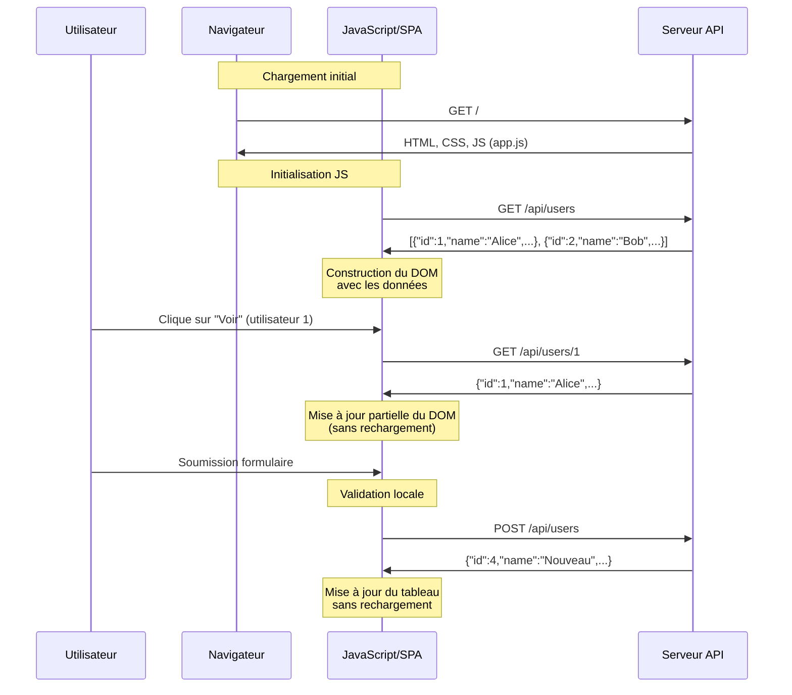

**Impact technique :**
- **Charge serveur** : Réduite (API uniquement)
- **Trafic réseau** : Données JSON uniquement (plus légères)
- **État client** : Complexe, maintenu côté client

**Exemple illustré :**

::: info Client Lourd - Vue d'ensemble
1. Utilisateur accède à `/`
2. Le serveur envoie l'application complète (HTML+CSS+JS)
3. Le JavaScript initialise l'application et fait une requête API :
   ```javascript
   // Côté client (app.js)
   fetch('/api/users')
     .then(response => response.json())
     .then(users => {
       // Construction dynamique du tableau
       const tbody = document.createElement('tbody');
       users.forEach(user => {
         const row = document.createElement('tr');
         row.innerHTML = `
           <td>${user.id}</td>
           <td>${user.name}</td>
           <td>${user.email}</td>...
         `;
         tbody.appendChild(row);
       });
       // ...
     });
   ```
4. Le serveur répond avec des données JSON :
   ```json
   [
     {"id": 1, "name": "Alice Smith", "email": "alice@example.com", "role": "Admin"},
     {"id": 2, "name": "Bob Johnson", "email": "bob@example.com", "role": "User"},
     {"id": 3, "name": "Charlie Brown", "email": "charlie@example.com", "role": "User"}
   ]
   ```
5. Les interactions utilisateur se font via AJAX, sans rechargement


:::

### 2.3 Coexistence des deux approches

Notre serveur Express est capable de servir les deux types de clients simultanément :

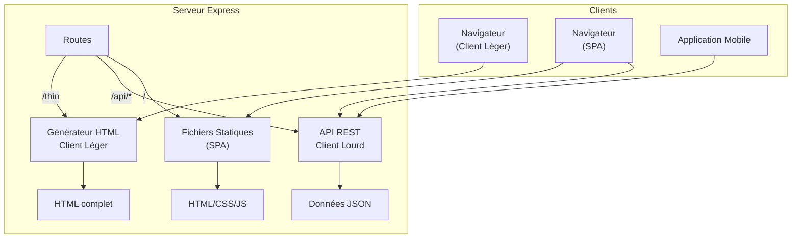


## 3. Exercices pratiques

Cette section contient des exercices pratiques pour vous aider à maîtriser les concepts d'architecture client-serveur et les bases de Node.js/Express.

### Exercice 1.1 : Création d'un serveur HTTP simple

**Objectif** : Créer un serveur HTTP de base avec Node.js et Express qui répond "Hello World".

**Prérequis** :
- Node.js installé sur votre machine

**Instructions** :

1. Créez un nouveau dossier pour votre projet
   ```bash
   mkdir exercice-1-1
   cd exercice-1-1
   ```

2. Initialisez un projet Node.js
   ```bash
   npm init -y
   ```

3. Installez Express
   ```bash
   npm install express
   ```

4. Créez un fichier `app.js`
   ```javascript
   // Importation d'Express
   const express = require('express');
   
   // Création d'une instance d'application Express
   const app = express();
   
   // Définition d'une route pour la racine du site
   app.get('/', (req, res) => {
     res.send('Hello World');
   });
   
   // Démarrage du serveur sur le port 3000
   const PORT = 3000;
   app.listen(PORT, () => {
     console.log(`Serveur démarré sur http://localhost:${PORT}`);
   });
   ```

5. Lancez votre serveur
   ```bash
   node app.js
   ```

6. Accédez à `http://localhost:3000` dans votre navigateur

::: tip Points clés
- `express()` crée une nouvelle instance d'application Express
- `app.get()` définit une route pour les requêtes GET
- `res.send()` envoie une réponse au client
- `app.listen()` démarre le serveur sur un port spécifique
:::

### Exercice 1.2 : Routage et gestion des erreurs

**Objectif** : Créer un serveur avec plusieurs routes et gestion des routes non trouvées.

**Instructions** :

1. Reprenez le projet précédent ou créez-en un nouveau
   
2. Modifiez ou créez le fichier `app.js` :
   ```javascript
   const express = require('express');
   const app = express();
   
   // Route racine
   app.get('/', (req, res) => {
     res.send('Accueil');
   });
   
   // Route contact
   app.get('/contact', (req, res) => {
     res.send('Contactez-nous');
   });
   
   // Route about
   app.get('/about', (req, res) => {
     res.send('À propos');
   });
   
   // Gestion des routes non trouvées (middleware 404)
   // Note : doit être placé après toutes les autres routes
   app.use((req, res) => {
     res.status(404).send('404 - Page non trouvée');
   });
   
   const PORT = 3000;
   app.listen(PORT, () => {
     console.log(`Serveur démarré sur http://localhost:${PORT}`);
   });
   ```

3. Testez ces routes dans votre navigateur :
   - `http://localhost:3000/`
   - `http://localhost:3000/contact`
   - `http://localhost:3000/about`
   - `http://localhost:3000/quelquechosedautre` (devrait afficher l'erreur 404)

::: tip Points clés
- Le middleware sans chemin (`app.use()`) est exécuté pour toutes les requêtes
- L'ordre des routes est important - le middleware 404 doit être placé après toutes les routes définies
- `res.status(404)` définit le code de statut HTTP de la réponse
:::

### Exercice 1.3 : Client léger avec génération HTML

**Objectif** : Créer un serveur qui génère des pages HTML pour un client léger.

**Instructions** :

1. Créez un nouveau projet Express
   
2. Dans le fichier `app.js`, créez un serveur avec une "base de données" simulée :
   ```javascript
   const express = require('express');
   const app = express();
   
   // Données simulées - liste de produits
   const products = [
     { id: 1, name: "Ordinateur portable", price: 899, category: "Électronique" },
     { id: 2, name: "Smartphone", price: 699, category: "Électronique" },
     { id: 3, name: "Casque audio", price: 149, category: "Audio" }
   ];
   
   // Page d'accueil - liste des produits
   app.get('/', (req, res) => {
     // Générez une page HTML qui affiche tous les produits sous forme de tableau
     let html = `
       <!DOCTYPE html>
       <html>
       <head>
         <title>Catalogue de produits</title>
         <style>
           body { font-family: Arial; margin: 20px; }
           table { border-collapse: collapse; width: 100%; }
           th, td { border: 1px solid #ddd; padding: 8px; text-align: left; }
           th { background-color: #f2f2f2; }
         </style>
       </head>
       <body>
         <h1>Catalogue de produits</h1>
         <table>
           <thead>
             <tr>
               <th>ID</th>
               <th>Nom</th>
               <th>Prix</th>
               <th>Catégorie</th>
               <th>Action</th>
             </tr>
           </thead>
           <tbody>
     `;
     
     // Générer les lignes du tableau
     // À COMPLÉTER : Ajoutez le code pour générer les lignes du tableau
     
     html += `
           </tbody>
         </table>
       </body>
       </html>
     `;
     
     res.send(html);
   });
   
   // Page de détail d'un produit
   app.get('/product/:id', (req, res) => {
     // À COMPLÉTER : Récupérez le produit par ID et générez une page HTML de détail
   });
   
   const PORT = 3000;
   app.listen(PORT, () => {
     console.log(`Serveur démarré sur http://localhost:${PORT}`);
   });
   ```

3. Complétez le code pour :
   - Générer les lignes du tableau avec tous les produits
   - Ajouter un lien "Voir détails" pour chaque produit qui pointe vers `/product/{id}`
   - Implémenter la route `/product/:id` qui affiche les détails d'un produit spécifique
   - Gérer le cas où le produit n'existe pas

### Exercice 1.4 : Client lourd avec API REST

**Objectif** : Créer une API REST et une interface client JavaScript.

**Instructions** :

1. Reprenez les données de l'exercice précédent dans un nouveau projet

2. Créez une API REST :
   ```javascript
   const express = require('express');
   const app = express();
   app.use(express.json());
   app.use(express.static('public'));
   
   // Mêmes données que l'exercice précédent
   const products = [
     { id: 1, name: "Ordinateur portable", price: 899, category: "Électronique" },
     { id: 2, name: "Smartphone", price: 699, category: "Électronique" },
     { id: 3, name: "Casque audio", price: 149, category: "Audio" }
   ];
   
   // API pour récupérer tous les produits
   app.get('/api/products', (req, res) => {
     res.json(products);
   });
   
   // API pour récupérer un produit spécifique
   app.get('/api/products/:id', (req, res) => {
     // À COMPLÉTER : Récupérer un produit par ID et le renvoyer en JSON
   });
   
   // Route principale pour servir l'application client
   app.get('/', (req, res) => {
     res.sendFile(__dirname + '/public/index.html');
   });
   
   app.listen(3000, () => console.log('Serveur démarré sur http://localhost:3000'));
   ```

3. Créez un dossier `public` et ajoutez un fichier `index.html` :
   ```html
   <!DOCTYPE html>
   <html>
   <head>
     <title>Catalogue de produits</title>
     <style>
       /* Ajoutez vos styles CSS ici */
     </style>
   </head>
   <body>
     <h1>Catalogue de produits</h1>
     
     <div id="products-list">
       Chargement des produits...
     </div>
     
     <div id="product-details" style="display:none">
       <!-- Les détails du produit sélectionné s'afficheront ici -->
     </div>
     
     <script>
       // À COMPLÉTER : Ajoutez le code JavaScript pour récupérer 
       // et afficher les produits depuis l'API
     </script>
   </body>
   </html>
   ```

4. Complétez le projet en :
   - Implémentant l'endpoint API manquant
   - Écrivant le code JavaScript pour récupérer les produits via fetch()
   - Affichant les produits dans un tableau HTML généré dynamiquement
   - Ajoutant une fonction pour afficher les détails d'un produit sans rechargement de page

### Exercice 1.5 : Comparaison des deux approches

**Objectif** : Créer une application qui démontre la différence entre client léger et lourd.

**Instructions** :

1. En vous inspirant de l'application de démonstration de la séance, créez votre propre application qui :
   - Implémente une fonctionnalité simple (ex: liste de tâches, blog, etc.)
   - Offre deux interfaces : une en client léger (`/thin`) et une en client lourd (`/`)
   - Permet de comparer visuellement et techniquement les deux approches

2. Votre application doit permettre au minimum :
   - D'afficher des données
   - De créer de nouvelles entrées
   - De modifier des entrées existantes
   - De supprimer des entrées

3. Documentez les différences que vous observez entre les deux implémentations en termes de :
   - Expérience utilisateur
   - Complexité du code
   - Performances
   - Trafic réseau (utilisez les outils de développement du navigateur)