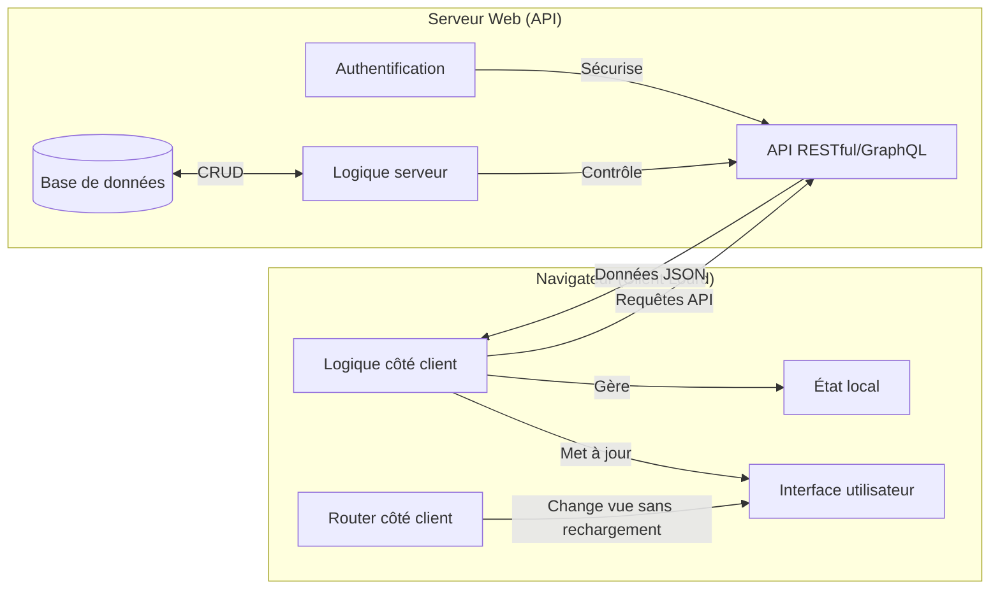
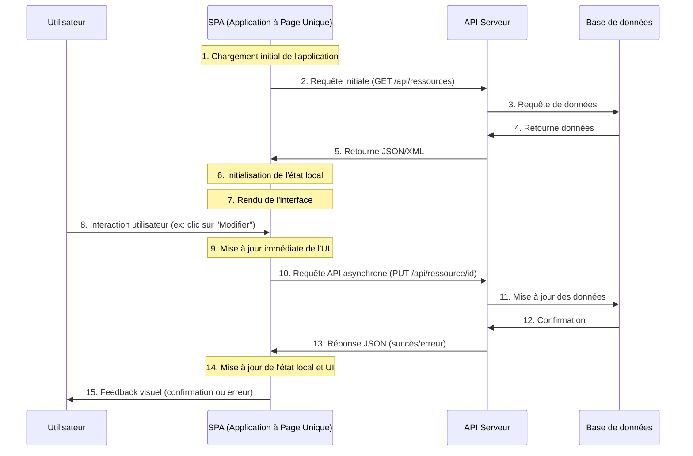
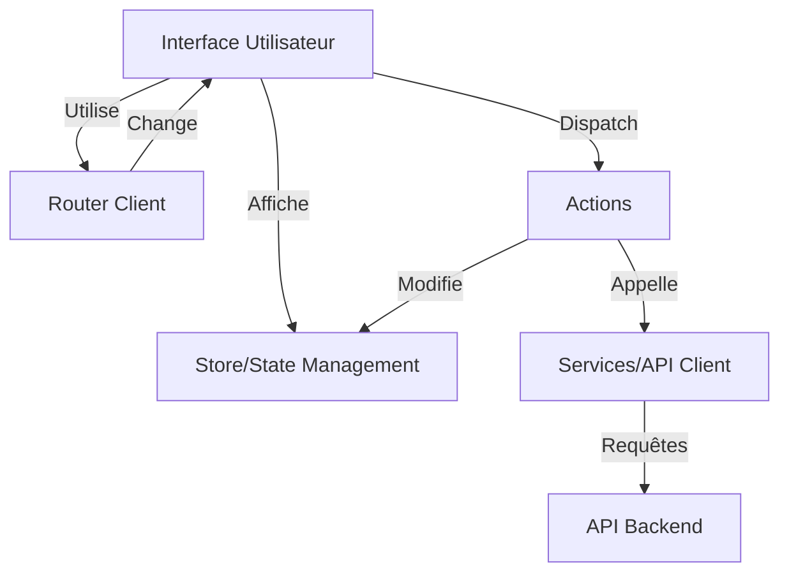

# Séance 2 : Architecture Client Lourd

## 1. Théorie

### 1.1 Introduction au Client Lourd (Rich Client)

Le client lourd délègue une part importante du traitement et de la logique au navigateur, créant des interfaces utilisateur plus riches et interactives.

**Caractéristiques:**
- Interface utilisateur riche et interactive, construite avec JavaScript
- Logique métier partiellement déplacée côté client
- Mise à jour dynamique de l'interface sans rechargement complet
- Communication avec le serveur principalement via API (REST, GraphQL)
- État temporaire maintenu côté client (state management)
- Applications à page unique (SPA - Single Page Applications)

**Exemples:**
- Applications web modernes développées avec React, Vue.js, Angular
- Applications mobiles web (PWA - Progressive Web Apps)
- Dashboards interactifs



### 1.2 Cycle de vie d'une requête dans un Client Lourd



**Points clés :**
- Une seule page initiale chargée, ensuite mises à jour dynamiques
- Communication asynchrone avec l'API serveur
- État maintenu côté client dans des stores/gestionnaires d'état
- Consommation réseau optimisée (uniquement les données nécessaires)
- Expérience utilisateur plus fluide (pas de rechargement)
- Développement plus complexe (gestion d'état, routage client, etc.)

### 1.3 Comparaison entre Client Léger et Client Lourd

| Aspect | Client Léger | Client Lourd |
|--------|------------|------------|
| Développement | Plus simple et rapide initialement | Plus complexe, nécessite plus de structure |
| Maintenance | Centralisée principalement sur le serveur | Répartie entre client et serveur |
| Performances | Dépendantes du serveur et du réseau | Meilleures après chargement initial |
| Expérience utilisateur | Moins fluide (rechargements de page) | Plus réactive et immersive |
| SEO | Excellent (tout est généré côté serveur) | Problématique sans SSR/techniques spécifiques |
| Compatibilité | Très bonne même sur navigateurs anciens | Peut nécessiter des polyfills/transpilation |
| Sécurité | Code critique reste sur le serveur | Plus de code exposé côté client |
| Consommation réseau | Plus élevée (pages complètes) | Moindre après chargement initial (uniquement data) |
| Charge serveur | Plus élevée (génération HTML) | Moindre (uniquement API data) |
| Complexité du déploiement | Plus simple (mise à jour centralisée) | Plus complexe (assets client + API) |

### 1.4 Quand choisir un Client Lourd?

Le client lourd est particulièrement adapté dans les situations suivantes :

1. **Applications hautement interactives** nécessitant des mises à jour fréquentes de l'interface.
2. **Interfaces complexes** avec de nombreuses interactions utilisateur et des transitions.
3. **Applications avec état** où l'utilisateur effectue plusieurs opérations liées.
4. **Expérience utilisateur prioritaire** sur des connexions stables.
5. **Applications métier internes** où le SEO n'est pas une priorité.

### 1.5 Architecture des Applications Client Lourd

Une application client lourd typique s'organise autour de plusieurs couches :



#### Éléments clés :

1. **Interface Utilisateur** : Composants d'interface qui affichent les données et gèrent les interactions utilisateur.
2. **State Management** : Gestion centralisée de l'état de l'application (Redux, Vuex, Context API).
3. **Services** : Couche d'abstraction pour les appels API et les fonctionnalités partagées.
4. **Router** : Gestion de la navigation et des "vues" sans rechargement de page.
5. **Actions/Events** : Flux de données et déclencheurs d'événements pour les mises à jour d'état.

## 2. Pratique : Création d'un client lourd simple

### 2.1 Mise en place d'une SPA basique avec JavaScript vanilla

Créons une application à page unique simple sans framework :

```html
<!-- index.html -->
<!DOCTYPE html>
<html lang="fr">
<head>
  <meta charset="UTF-8">
  <meta name="viewport" content="width=device-width, initial-scale=1.0">
  <title>SPA Basique</title>
  <link rel="stylesheet" href="css/style.css">
</head>
<body>
  <!-- Barre de navigation -->
  <nav>
    <a href="#" data-route="home">Accueil</a>
    <a href="#" data-route="about">À propos</a>
    <a href="#" data-route="contact">Contact</a>
  </nav>
  
  <!-- Conteneur principal où les "pages" seront injectées -->
  <main id="app"></main>
  
  <script src="js/app.js"></script>
</body>
</html>
```

```javascript
// app.js
document.addEventListener('DOMContentLoaded', () => {
  // Conteneur principal
  const appContainer = document.getElementById('app');
  
  // Routes et contenu associé
  const routes = {
    'home': {
      title: 'Accueil',
      content: `
        <div class="page">
          <h1>Bienvenue sur notre SPA</h1>
          <p>Cette application utilise JavaScript pour changer de page sans rechargement.</p>
          <button id="load-data">Charger des données</button>
          <div id="data-container"></div>
        </div>
      `
    },
    'about': {
      title: 'À propos',
      content: `
        <div class="page">
          <h1>À propos de nous</h1>
          <p>Nous sommes une équipe qui développe des applications web modernes.</p>
          <p>Cette page est chargée dynamiquement sans rechargement du navigateur.</p>
        </div>
      `
    },
    'contact': {
      title: 'Contact',
      content: `
        <div class="page">
          <h1>Contactez-nous</h1>
          <form id="contact-form">
            <div class="form-group">
              <label for="name">Nom</label>
              <input type="text" id="name" required>
            </div>
            <div class="form-group">
              <label for="email">Email</label>
              <input type="email" id="email" required>
            </div>
            <div class="form-group">
              <label for="message">Message</label>
              <textarea id="message" rows="4" required></textarea>
            </div>
            <button type="submit">Envoyer</button>
          </form>
          <div id="form-response"></div>
        </div>
      `
    }
  };
  
  // Fonction pour naviguer vers une route
  function navigateTo(route) {
    if (routes[route]) {
      // Mettre à jour le contenu
      appContainer.innerHTML = routes[route].content;
      document.title = routes[route].title;
      
      // Ajouter les gestionnaires d'événements spécifiques à la page
      if (route === 'home') {
        document.getElementById('load-data')?.addEventListener('click', fetchData);
      } else if (route === 'contact') {
        document.getElementById('contact-form')?.addEventListener('submit', handleFormSubmit);
      }
    }
  }
  
  // Ajouter les écouteurs d'événements pour la navigation
  document.querySelectorAll('nav a').forEach(link => {
    link.addEventListener('click', (e) => {
      e.preventDefault();
      const route = e.target.getAttribute('data-route');
      navigateTo(route);
      // Mettre à jour l'URL sans recharger la page (navigation historique)
      window.history.pushState(null, routes[route].title, `#${route}`);
    });
  });
  
  // Gestion des données API
  async function fetchData() {
    const dataContainer = document.getElementById('data-container');
    dataContainer.innerHTML = 'Chargement...';
    
    try {
      // Simuler un appel API (remplacez par un vrai appel API dans un cas réel)
      const response = await new Promise(resolve => {
        setTimeout(() => {
          resolve({
            data: [
              { id: 1, name: 'Item 1', description: 'Description de l\'item 1' },
              { id: 2, name: 'Item 2', description: 'Description de l\'item 2' },
              { id: 3, name: 'Item 3', description: 'Description de l\'item 3' },
            ]
          });
        }, 1000);
      });
      
      // Générer le HTML pour les données
      const html = `
        <h3>Données chargées</h3>
        <ul class="data-list">
          ${response.data.map(item => `
            <li>
              <h4>${item.name}</h4>
              <p>${item.description}</p>
            </li>
          `).join('')}
        </ul>
      `;
      
      dataContainer.innerHTML = html;
    } catch (error) {
      dataContainer.innerHTML = `<p class="error">Erreur: ${error.message}</p>`;
    }
  }
  
  // Gestion du formulaire
  function handleFormSubmit(e) {
    e.preventDefault();
    const formResponse = document.getElementById('form-response');
    const name = document.getElementById('name').value;
    const email = document.getElementById('email').value;
    const message = document.getElementById('message').value;
    
    // Simuler un envoi de formulaire
    formResponse.innerHTML = 'Envoi en cours...';
    
    // Simuler une réponse après 1 seconde
    setTimeout(() => {
      formResponse.innerHTML = `
        <div class="success">
          Message envoyé avec succès!
          <p>Résumé: ${name} (${email}): ${message.substring(0, 20)}...</p>
        </div>
      `;
    }, 1000);
  }
  
  // Navigation initiale basée sur le hash URL ou page d'accueil par défaut
  const initialRoute = window.location.hash.substring(1) || 'home';
  navigateTo(initialRoute);
  
  // Gestion du bouton retour du navigateur
  window.addEventListener('popstate', () => {
    const currentRoute = window.location.hash.substring(1) || 'home';
    navigateTo(currentRoute);
  });
});
```

#### Exercice 2.1: Étendre l'application SPA

Étendez l'application pour ajouter une nouvelle page "Produits" qui affiche une liste de produits à partir d'un API simulé.

### 2.2 Introduction à un framework frontend (Vue.js)

Pour les applications plus complexes, les frameworks comme Vue.js, React ou Angular offrent une structure et des outils plus puissants. Voici un exemple avec Vue.js :

```html
<!-- index.html -->
<!DOCTYPE html>
<html lang="fr">
<head>
  <meta charset="UTF-8">
  <meta name="viewport" content="width=device-width, initial-scale=1.0">
  <title>Application Vue</title>
  <link rel="stylesheet" href="css/style.css">
  <script src="https://unpkg.com/vue@3/dist/vue.global.js"></script>
</head>
<body>
  <div id="app"></div>
  
  <script src="js/app.js" type="module"></script>
</body>
</html>
```

```javascript
// app.js
const { createApp, ref } = Vue;

const App = {
  template: `
    <div class="vue-app">
      <nav>
        <a @click.prevent="currentView = 'home'" href="#">Accueil</a>
        <a @click.prevent="currentView = 'about'" href="#">À propos</a>
        <a @click.prevent="currentView = 'contact'" href="#">Contact</a>
      </nav>
      
      <main>
        <!-- Composant dynamique basé sur la vue actuelle -->
        <component :is="views[currentView]"></component>
      </main>
    </div>
  `,
  
  setup() {
    const currentView = ref('home');
    
    // Définition des composants de vue
    const HomeView = {
      template: `
        <div class="page">
          <h1>Bienvenue sur notre application Vue</h1>
          <p>Cette application utilise Vue.js pour gérer les différentes vues.</p>
          <button @click="loadData">Charger des données</button>
          <div v-if="loading">Chargement...</div>
          <div v-else-if="data.length" class="data-container">
            <h3>Données chargées</h3>
            <ul class="data-list">
              <li v-for="item in data" :key="item.id">
                <h4>{{ item.name }}</h4>
                <p>{{ item.description }}</p>
              </li>
            </ul>
          </div>
        </div>
      `,
      setup() {
        const data = ref([]);
        const loading = ref(false);
        
        const loadData = async () => {
          loading.value = true;
          // Simuler un appel API
          await new Promise(resolve => setTimeout(resolve, 1000));
          data.value = [
            { id: 1, name: 'Item Vue 1', description: 'Description de l\'item 1' },
            { id: 2, name: 'Item Vue 2', description: 'Description de l\'item 2' },
            { id: 3, name: 'Item Vue 3', description: 'Description de l\'item 3' },
          ];
          loading.value = false;
        };
        
        return { data, loading, loadData };
      }
    };
    
    const AboutView = {
      template: `
        <div class="page">
          <h1>À propos de nous</h1>
          <p>Nous utilisons Vue.js pour créer des applications web modernes et réactives.</p>
          <p>Cette vue est un composant Vue rendu dynamiquement.</p>
        </div>
      `
    };
    
    const ContactView = {
      template: `
        <div class="page">
          <h1>Contactez-nous</h1>
          <form @submit.prevent="submitForm">
            <div class="form-group">
              <label for="name">Nom</label>
              <input type="text" id="name" v-model="form.name" required>
            </div>
            <div class="form-group">
              <label for="email">Email</label>
              <input type="email" id="email" v-model="form.email" required>
            </div>
            <div class="form-group">
              <label for="message">Message</label>
              <textarea id="message" rows="4" v-model="form.message" required></textarea>
            </div>
            <button type="submit">Envoyer</button>
          </form>
          <div v-if="submitting">Envoi en cours...</div>
          <div v-if="submitted" class="success">
            Message envoyé avec succès!
            <p>Résumé: {{ form.name }} ({{ form.email }}): {{ form.message.substring(0, 20) }}...</p>
          </div>
        </div>
      `,
      setup() {
        const form = ref({ name: '', email: '', message: '' });
        const submitting = ref(false);
        const submitted = ref(false);
        
        const submitForm = () => {
          submitting.value = true;
          // Simuler l'envoi du formulaire
          setTimeout(() => {
            submitting.value = false;
            submitted.value = true;
          }, 1000);
        };
        
        return { form, submitting, submitted, submitForm };
      }
    };
    
    const views = {
      home: HomeView,
      about: AboutView,
      contact: ContactView
    };
    
    return { currentView, views };
  }
};

// Créer et monter l'application Vue
createApp(App).mount('#app');
```

#### Exercice 2.2: Ajouter une fonctionnalité à l'application Vue

Ajoutez une nouvelle vue "Produits" à l'application Vue qui permet de filtrer une liste de produits par catégorie.

## 3. Conclusion

Le client lourd représente une approche moderne du développement web, offrant une expérience utilisateur plus fluide et interactive. Par rapport au client léger que nous avons étudié dans la séance précédente, le client lourd offre plusieurs avantages en termes de réactivité et d'interactions utilisateur, mais présente également des défis supplémentaires en termes de complexité de développement et de déploiement.

**Points clés à retenir :**
- Le client lourd déplace une partie significative de la logique métier et du traitement vers le navigateur
- L'architecture repose sur une séparation claire entre l'interface utilisateur (frontend) et les services de données (API backend)
- Les frameworks modernes comme React, Vue et Angular facilitent le développement d'applications client lourd
- La gestion de l'état client est une considération importante dans ce type d'architecture
- Le choix entre client léger et client lourd dépend des besoins spécifiques de l'application et du contexte
